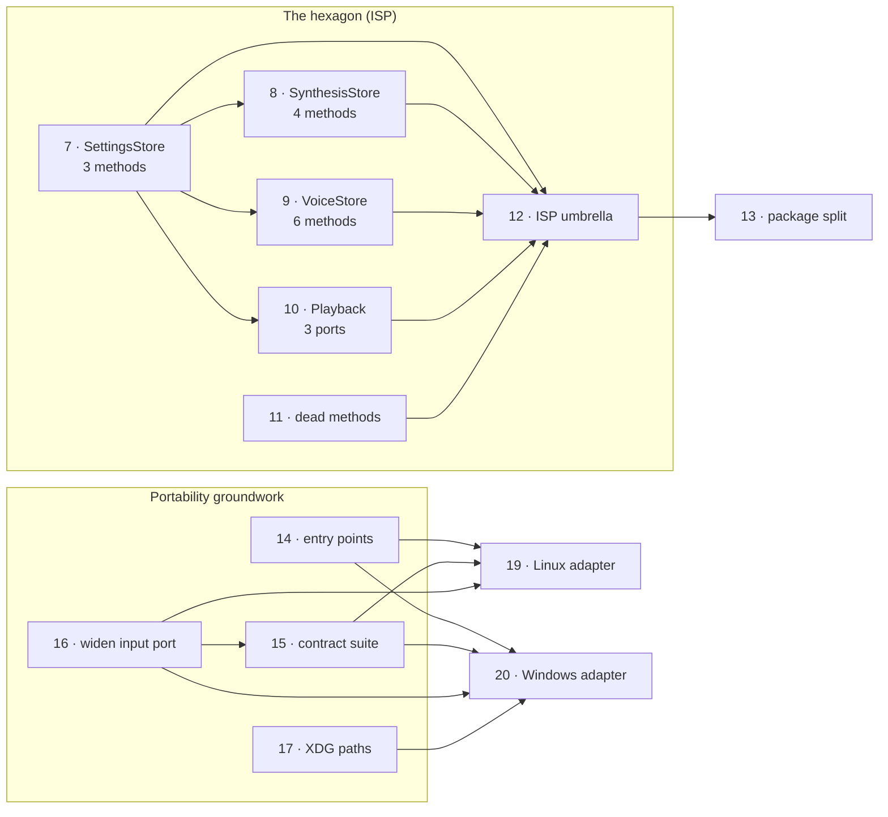

# Roadmap

**[GitHub Issues](https://github.com/flyingrobots/AI-TTS/issues) is the tracker.
This file is not.**

What this adds is the one thing an issue tracker cannot express: *why* the work
is ordered the way it is. It carries no status — no checkboxes, no "done" — so
it cannot drift out of sync with reality on state. It can go stale on
*structure*, when dependencies change, and the command at the bottom
regenerates the ordering from the live graph.

Sequencing below is derived from the `blockedBy` / `blocking` relationships set
on the issues themselves, not from an opinion held in this file.

## The shape of it



Four waves deep, and that is the good news: **nothing is deeply serialised.**
Thirteen of the twenty-one open issues have no blocker at all, so the graph is
wide rather than long and most of this can proceed in parallel.

## Phase 0 — cheap, and they make later work smaller

Do these first because each is small and at least two of them shrink the
surface of the work that follows.

| | Why now |
|---|---|
| [#21](https://github.com/flyingrobots/AI-TTS/issues/21) | A three-line correction to a claim this repository makes about itself in `architecture.md` §9a. Wrong documentation about portability is the worst thing to leave standing while planning portability. |
| [#11](https://github.com/flyingrobots/AI-TTS/issues/11) | One dead method, one that should be private. Takes `Store` from 41 public methods to 39 *before* the port surfaces get written. **Good first issue.** |
| [#17](https://github.com/flyingrobots/AI-TTS/issues/17) | The last genuine platform coupling in the core: four lines hardcoding the macOS state directory. **Good first issue**, and it unblocks [#20](https://github.com/flyingrobots/AI-TTS/issues/20). |

## Phase 1 — the hexagon

This is the critical path, and it starts with one issue.

[**#7**](https://github.com/flyingrobots/AI-TTS/issues/7) extracts a
three-method `SettingsStore` port. It blocks
[#8](https://github.com/flyingrobots/AI-TTS/issues/8),
[#9](https://github.com/flyingrobots/AI-TTS/issues/9) and
[#10](https://github.com/flyingrobots/AI-TTS/issues/10) not because they need
its code, but because it settles the shape they all copy. It is the smallest of
the four and the pattern is already proven in `application/cache.py`, where
`CacheMetadataPort` is two methods and `Store` satisfies it structurally with no
changes at all.

Then [#8](https://github.com/flyingrobots/AI-TTS/issues/8) and
[#9](https://github.com/flyingrobots/AI-TTS/issues/9) in parallel — four and
six methods, mechanical once #7 lands. Then
[#10](https://github.com/flyingrobots/AI-TTS/issues/10) last, because
`PlaybackController` is the most heavily tested module in the repository and its
14-method dependency is really three ports.

[#12](https://github.com/flyingrobots/AI-TTS/issues/12) closes when all five
land. It is the umbrella, and it holds the full analysis.

> **On effort versus depth.** The dependency graph's critical path is
> `#7 → #8 → #12 → #13`, but the algorithm picks #8 arbitrarily from three
> equal-depth siblings. By *effort* the path runs through
> [#10](https://github.com/flyingrobots/AI-TTS/issues/10), which is larger than
> #8 and #9 combined. Plan around #10.

## Phase 2 — portability groundwork, in parallel with Phase 1

None of this touches the same files as Phase 1, so it can run alongside.

[**#16**](https://github.com/flyingrobots/AI-TTS/issues/16) comes first and is
the one most likely to be skipped wrongly. `InputActivityPort` currently
answers `bool | None` because that is all CoreAudio can say — per device,
sticky for minutes after capture stops. PipeWire and WASAPI can answer per
*process*, precisely. Ship the platform adapters against today's port and both
inherit a debounce written to work around a limitation they do not have. It
blocks [#15](https://github.com/flyingrobots/AI-TTS/issues/15),
[#19](https://github.com/flyingrobots/AI-TTS/issues/19) and
[#20](https://github.com/flyingrobots/AI-TTS/issues/20).

[**#14**](https://github.com/flyingrobots/AI-TTS/issues/14) and
[**#15**](https://github.com/flyingrobots/AI-TTS/issues/15) are the pair that
decide whether community platform work is possible at all. Entry points make an
adapter *installable* without a pull request against core; the contract suite
makes it *checkable* — a contributor knows when it is finished instead of
guessing at expectations that currently live in prose.

## Phase 3 — the split

[**#13**](https://github.com/flyingrobots/AI-TTS/issues/13) — `aitts-core`,
`aitts-daemon`, `aitts-platform-macos`, `aitts-tui`, `clients/macos`, one
shared version.

Blocked on [#12](https://github.com/flyingrobots/AI-TTS/issues/12), and the
reason is worth stating because it is tempting to start here. `application/`
is *already* a sealed hexagon — it imports nothing but itself and
`aitts.model`. So `aitts-core` could be carved out this afternoon. But the four
domain services import `Store` concretely, so without the ports you get a core
of contracts and pure functions while every interesting behaviour stays in the
daemon. Doing #13 first produces the package names and none of the benefit.

## Phase 4 — the other platforms

[**#19**](https://github.com/flyingrobots/AI-TTS/issues/19) (Linux, PipeWire)
and [**#20**](https://github.com/flyingrobots/AI-TTS/issues/20) (Windows,
WASAPI). Both **help wanted**, and deliberately gated behind #14, #15 and #16
so that contributing means writing an adapter rather than doing archaeology.

#20 is the larger of the two and its hardest question is not audio: the IPC is
a Unix socket whose `0600` permissions are the entire authentication story, and
whether that model translates to Windows is open. Answer that before writing
any WASAPI code.

## Independent — no blockers, any time

**Product features:**
[#1](https://github.com/flyingrobots/AI-TTS/issues/1) decline admission while
held · [#2](https://github.com/flyingrobots/AI-TTS/issues/2) per-source
authorization · [#3](https://github.com/flyingrobots/AI-TTS/issues/3) collapse
duplicate text · [#5](https://github.com/flyingrobots/AI-TTS/issues/5) history
search

**Defects:** [#4](https://github.com/flyingrobots/AI-TTS/issues/4) elapsed time
under-reports after a skip · [#6](https://github.com/flyingrobots/AI-TTS/issues/6)
one unreproduced `swift test` crash

**Worth pulling forward:**
[#18](https://github.com/flyingrobots/AI-TTS/issues/18), the TUI client. It has
no blockers and it is the only thing that genuinely validates the socket
contract — a protocol with one consumer has never been tested as a protocol.
It is also the first client that runs anywhere, before any platform adapter
exists, since a terminal UI needs neither device following nor microphone
interrupts to be useful.

## Regenerating the ordering

```sh
gh api graphql -f query='
{
  repository(owner: "flyingrobots", name: "AI-TTS") {
    issues(first: 50, states: OPEN) {
      nodes { number title blockedBy(first: 10) { nodes { number } } }
    }
  }
}' | python3 -c '
import json, sys
n = json.load(sys.stdin)["data"]["repository"]["issues"]["nodes"]
blockers = {i["number"]: {b["number"] for b in i["blockedBy"]["nodes"]} for i in n}
done, wave = set(), 1
while len(done) < len(blockers):
    ready = sorted(k for k in blockers if k not in done and blockers[k] <= done)
    if not ready: print("cycle:", sorted(set(blockers) - done)); break
    print(f"Wave {wave}:", " ".join(f"#{r}" for r in ready))
    done |= set(ready); wave += 1
'
```

If that output disagrees with the phases above, the graph is right and this
file is stale.
