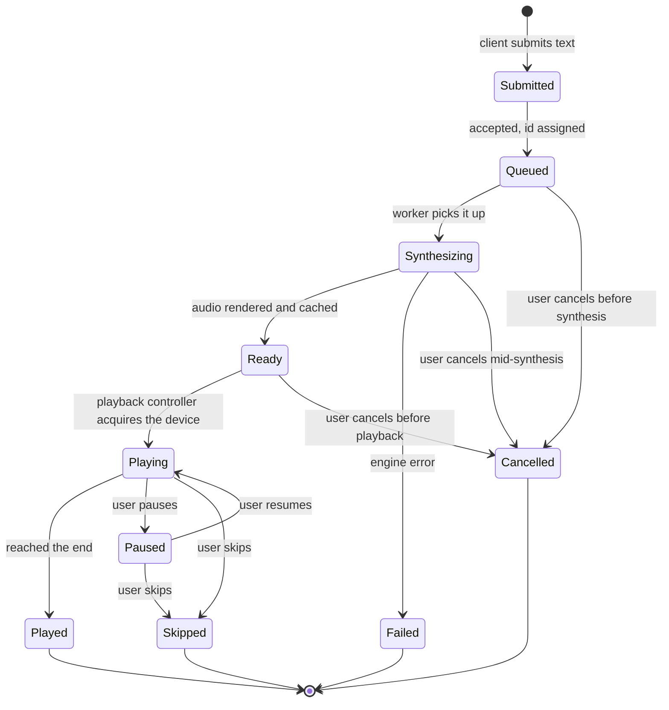
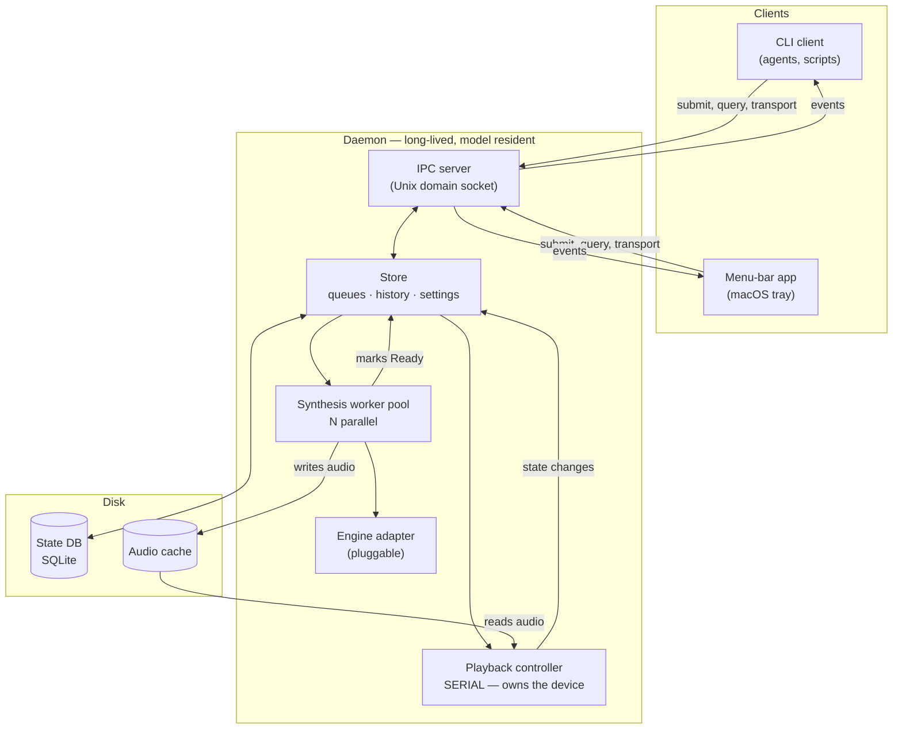

# AI-TTS — Architecture

**Status:** implemented in v0.1.0 (`src/aitts/`). This document remains the spec; the test suite encodes its semantics.
**Scope:** a local-first, single-user speech daemon that accepts text from many clients, synthesizes ahead of playback, and gives the user transport control over what is spoken.

---

## 1. The problem, stated as failures

This design is not speculative. The setup it replaces failed four ways in one evening, and **three of the four produced silence at exit code 0**, the worst possible failure shape, because every automated caller treats it as success.

| # | Failure | What the caller saw | What must be true instead |
|---|---|---|---|
| **F1** | Server hung after queueing segments | Exit 0, no audio | **Queueing is not speaking.** Submission returns an id, not a success; completion is a separate observable event |
| **F2** | One-off wrapper discarded stderr, which carried the only playback signal | Exit 0, no audio | **Playback state must be queryable structured data**, never a side-channel a caller can drop |
| **F3** | Shell timeout truncated playback mid-sentence | Partial audio, exit 0 | **The caller's process lifetime must not bound playback.** A daemon outlives its clients |
| **F4** | Two utterances played simultaneously and overlapped | Garbled audio | **Playback is a strictly serialized resource.** Exactly one utterance may hold the output device |

**F1–F3 share one root: the caller inferred outcome from a transport signal.** That is the same defect regardless of layer: an exit code, a hung socket, a dropped stream. The architecture's answer is that **a client never infers; it observes.** Submission and completion are different events with different identifiers, and the daemon will tell you the difference if you ask.

**F4 is different and simpler:** nothing owned the audio device. One component now does.

---

## 2. Why two queues

The single most important structural decision. **Synthesis and playback have opposite characteristics and must not share a queue.**

| | Synthesis | Playback |
|---|---|---|
| Speed | Slow (hundreds of ms to seconds per utterance) | Real-time by definition |
| Parallelism | Safe to run N at once | **Strictly serial — exactly one** |
| Ordering | May complete out of order | Must be presented in order |
| Who controls it | The daemon, opportunistically | **The user**, via transport |
| Can run ahead? | **Yes, and should** | No — it is the present moment |

**The payoff is that synthesis runs ahead of playback.** While utterance *n* is being spoken, *n+1* and *n+2* are already rendered and cached. The user hears no gap. If they were one queue, every utterance would pay full synthesis latency at the moment it was needed.

**The cost is that they can diverge**, and the design must say what happens when they do (§7). This boundary is internal. The menu-bar app merges all non-current, non-terminal states into one ordered Queue so an item cannot disappear merely because it crossed from synthesis to playback readiness.

---

## 3. Utterance lifecycle

One utterance, every state it can occupy. **Nothing moves between states except through a named transition.**



**Notes on the states that carry weight:**

- **`Queued` vs `Ready`** is the whole reason for two queues. `Queued` is on the *input* queue; `Ready` is on the *playback* queue. An utterance is on exactly one at a time.
- **`Failed` is terminal and observable.** F1 and F2 exist because failure was indistinguishable from success. A failed utterance stays in history with its error.
- **`Skipped` and `Played` are different terminal states** and history must preserve which. "What did you tell me?" and "what did I actually hear?" are different questions.
- **Sensitivity is assigned at `Submitted` and never changes.** It travels with the utterance through every state and is what §9's routing check reads. An utterance cannot be reclassified after submission. Reclassification would mean the same id meant two different things at two times, and history would not be able to say which.
- **`Paused` belongs to the utterance, not the queue.** Pausing stops the current utterance; it does not clear what is behind it.

---

## 4. Components



**Boundaries, and why each exists:**

- **Daemon** — long-lived, model resident. **This is what makes generation hot rather than cold**, and it is what makes F3 impossible: playback is not bounded by any client's process lifetime.
- **Playback controller** — **the only component permitted to touch the audio device.** It is single-threaded by construction. This is the entire fix for F4; overlap is not prevented by convention but by there being one owner.
- **Synthesis worker pool** — N parallel workers. N is a setting, not a constant.
- **Engine adapter** — see §8. The engine is a detail, not the architecture.
- **Store** — the single source of truth for both queues, history and settings. **Components communicate through it rather than with each other**, so state is inspectable at one place rather than reconstructed from several.
- **Clients are thin and interchangeable.** The tray app and the CLI have the same rights and use the same protocol. **Nothing the tray can do is unavailable to an agent.**

---

## 5. IPC

### Unix domain socket, not HTTP

**Argued rather than assumed:**

| | UDS | Local HTTP |
|---|---|---|
| Access control | **Filesystem permissions.** `0600` on the socket means one user, enforced by the kernel | A port is reachable by every process on the machine; auth must be built |
| Confidentiality | **Never traverses a network interface.** Nothing to bind to `0.0.0.0` by accident | One config mistake exposes it |
| Discovery | Well-known path | Port conflicts, a port file, or a fixed port that may be taken |
| Streaming events | Natural over a persistent connection | Needs SSE or WebSocket |
| Cost | No HTTP stack | Framework, routing, serialization |

**The confidentiality column decides it.** The text this daemon speaks is client-confidential (§9). **A Unix socket cannot be accidentally exposed to a network; a listening port can.** That asymmetry is worth more than HTTP's tooling convenience for a single-user local daemon.

**Rejected alternative — a file-drop directory:** simple, but gives no request/response, no subscription, and turns every transport command into a race.

### Wire shape

Newline-delimited JSON, request/response plus a subscription mode. Every response carries `ok` and, on failure, a typed `error`, **never an empty response that a client might read as success (F2).**

```jsonc
// submit — returns immediately with an id. THIS IS NOT "IT WAS SPOKEN".
→ {"op":"submit", "text":"...", "voice":"bm_daniel", "priority":"normal",
   "sensitivity":"confidential"}          // REQUIRED. omitted ⇒ treated as confidential
← {"ok":true, "id":"utt_01J...", "state":"Queued", "sensitivity":"confidential",
   "eligible_engines":["local"]}          // the daemon tells you what may speak it

// list either queue
→ {"op":"list", "queue":"input"}      // Submitted | Queued | Synthesizing
→ {"op":"list", "queue":"playback"}   // Ready | Playing | Paused
← {"ok":true, "items":[{"id":"utt_...","state":"Ready","text":"...","enqueued_at":"..."}]}

// transport
→ {"op":"pause"} | {"op":"resume"} | {"op":"skip"}
→ {"op":"rewind"}                         // restart the current utterance
→ {"op":"rewind", "to":"utt_..."}      // legacy play-next/replay operation
→ {"op":"cancel", "id":"utt_..."}      // legal in Queued, Synthesizing, Ready
← {"ok":true, "state":"Paused", "current":"utt_..."}

// unified pending plan
→ {"op":"snapshot"}                       // current + complete ordered plan + history
→ {"op":"reorder", "ids":["utt_2","utt_1"]} // every pending id, exactly once
→ {"op":"clear", "queue":"queue"}       // current keeps playing

// history
→ {"op":"history", "limit":100, "before":"utt_..."}
← {"ok":true, "items":[{"id":"...","text":"...","final_state":"Played|Skipped|Failed|Cancelled", ...}]}
→ {"op":"requeue", "id":"utt_...", "priority":"normal|urgent"}
→ {"op":"remove_history", "id":"utt_..."}
→ {"op":"clear", "queue":"history"}

// subscribe — the fix for F1 and F2
→ {"op":"subscribe", "events":["state"]}
← {"event":"state_changed", "id":"utt_...", "from":"Synthesizing", "to":"Ready"}
← {"event":"state_changed", "id":"utt_...", "from":"Playing", "to":"Played"}
```

**A caller that must know an utterance was actually spoken subscribes and waits for its terminal state.** It does not read an exit code. That is the whole lesson of F1–F3 expressed as protocol.

---

## 6. Persistence

**SQLite for state, files for audio.** SQLite because both queues, history and settings want transactional updates and ordered queries, and because a half-written state file after a crash is exactly the ambiguity this design is trying to remove.

```
~/Library/Application Support/ai-tts/     (macOS)
  state.db          utterances, queue positions, settings
  cache/            <utterance-id>.wav
  ai-tts.sock       the IPC socket, mode 0600
```

**What survives a restart:**

| | Survives | Why |
|---|---|---|
| History | **Yes, permanently** | *"I want to have a history of all the things you've told me. It should all be there."* |
| Input queue | **Yes** | Unsynthesized text is not recoverable from anywhere else |
| Playback queue | **Yes, paused** | See below |
| Current position within an utterance | Yes, best-effort | Resume mid-sentence if the offset is known |
| Audio cache | Yes, subject to eviction | |

**A restored playback queue comes back `Paused`, never `Playing`.** A daemon that restarts and immediately begins speaking is a daemon that talks when nobody expects it, a worse failure than silence, because it happens in a room.

**Cache eviction:** audio for terminal utterances is evictable; audio for `Ready` utterances never is. Default policy LRU under a size cap (setting, default ~1 GB), **with history rows retained after their audio is evicted**: the text is the durable record, the audio is a cache. A history entry whose audio has been evicted is marked so, rather than failing on replay.

---

## 7. Transport semantics, and what interruption does to the other queue

**This is where the two queues interact, and the answers must be explicit rather than emergent.**

- **`pause`** — stops the current utterance, holds its position. **Synthesis continues.** Running ahead while paused is exactly right; the user will want the buffer full when they resume.
- **`skip`** — current utterance → `Skipped`, next `Ready` utterance begins. **The input queue is untouched.** Skipping one thing is not a request to stop hearing everything.
- **`rewind`** — either within the current utterance (`seconds`) or to a previous one (`to: utt_id`). **Rewinding to a played utterance replays from cache**; if evicted, it is re-synthesized. Rewind does not delete what was ahead of it. The queue is restored after the replayed item.
- **`cancel <id>`** — legal in `Queued`, `Synthesizing` and `Ready`. Cancelling a `Synthesizing` utterance signals the worker; the engine adapter may not support mid-generation abort, in which case the result is discarded on completion. **Cancel is not legal for a `Playing` utterance — that is `skip`**, and keeping them distinct keeps history honest about what happened.
- **`clear`** — drains a named queue. **Requires naming which one.** There is no single "stop everything" that silently discards unsynthesized input.

**Barge-in.** A high-priority submission (`priority: "urgent"`) may pause the current utterance and play ahead of the queue. **This is off by default.** An agent that can interrupt the user mid-sentence will do so at the wrong moment. When enabled, the interrupted utterance returns to `Ready` at the head of the queue, not to `Skipped`.

---

## 8. The engine interface

**The engine is pluggable and this document does not choose one.** `bm_daniel` is a voice in the engine used today; whether that engine remains the right one is being researched separately and **must not be baked in here.**

An engine adapter implements:

```
synthesize(text, voice, opts) -> audio           # required
list_voices() -> [voice_id, ...]                 # required — the UI enumerates, never hardcodes
supports_streaming() -> bool                     # optional capability
synthesize_streaming(text, voice) -> chunks      # required IFF supports_streaming
cancel(handle) -> bool                           # optional; false means "cannot abort mid-generation"
warmup() -> None                                 # optional; called once at daemon start
```

**What the interface demands of any candidate engine:**
- **Voice enumeration**, so voice selection is a UI concern rather than a shell flag, which is the stated requirement.
- **Deterministic output for identical input**, or the cache is unsound.
- **A declared answer on streaming.** Streaming lowers time-to-first-audio for long text; an engine without it must chunk at sentence boundaries instead. **The daemon handles chunking, not the engine adapter**, so a non-streaming engine is not disqualified.
- **An honest `cancel`.** Returning `false` is fine and is handled (§7). Lying about it is not.

### A pronunciation lexicon beats an engine swap

**Engine-independent, and worth more than model selection for this workload.** The text this speaks is dense with `ABC-12345`, `featureflag`, `snake_case`, file paths and version strings: exactly what small TTS models mangle, and exactly what no engine change reliably fixes.

**A user-editable pronunciation lexicon, applied by the daemon before text reaches any engine**, corrects more perceived quality than swapping models. It belongs in the daemon rather than the adapter for the same reason chunking does: it must work identically across engines, and it must survive an engine change.

**Chunking is the daemon's job.** Long text is split at sentence boundaries into separately cacheable segments so that skip and rewind have somewhere to land, and so that a long paragraph does not block the queue on one large generation.

---

## 9. Local-first, and where the confidentiality guard actually sits

**The text this daemon speaks is client-confidential.** That is a hard constraint, not a preference.

### The guard is on the text, not on the engine

An earlier draft of this section put the guard at the engine boundary: *a remote engine adapter must be opt-in, explicit, and named at the point of configuration.* **That is true and it is not sufficient**, and the engine research is what showed why.

**An engine-level switch knows which engine is selected. It cannot tell a release note from an artifact audit.**

The dangerous case is not someone maliciously enabling a cloud engine. It is **a cloud engine correctly enabled for public content, and then something confidential entering the same queue.** The engine-level guard is satisfied, returns true, and the leak happens anyway. **A guard that passes while the thing it guards against occurs is the same failure family as the four exit-0 silences in §1**, and this one is silent *and* irreversible, because text that reaches a third party cannot be recalled.

**So sensitivity is a property of the utterance, carried from submission through to playback, and routing is decided from it.** The caller knows what the text is; the engine never can.

### Sensitivity as a first-class field

Every utterance carries a classification, assigned at submit and immutable thereafter:

| Class | Meaning | May be spoken by |
|---|---|---|
| `public` | Safe to paste into a public channel | any engine, local or remote |
| `internal` | Not public, not client-identifying | local engines only |
| `confidential` | **Default.** Client content, colleague or customer names, internal identifiers, access lists, file paths, anything from a working repository | **local engines only, always** |

**Fail-closed by construction: an utterance submitted without a `sensitivity` field is `confidential`.** A caller cannot leak by forgetting; only by explicitly declaring text public. **That is the same move as §1's fix for F4**: not a rule people follow, but a default that makes the unsafe path require an affirmative act.

**The routing check happens before an engine is selected, not inside one.** An engine adapter is never asked to decide whether it may speak something; the daemon decides, and only offers the utterance to engines eligible for its class. `submit` returns `eligible_engines` so a caller can see the consequence of its own classification immediately rather than discovering it later.

**Concretely, and this is enforced in code rather than documented as guidance:** a remote engine may speak only `public` text. Never working-repository content, internal notes and analysis, artifact bodies, or anything naming a colleague, customer, internal identifier or access list.

### The rest of the local-first posture

- **Nothing leaves the machine by default.** No telemetry, no crash reporting, no update pings.
- **A remote engine adapter remains possible, opt-in, and named at the point of configuration**, but it is now the *second* gate, not the only one.
- **The socket is `0600`**; the state DB and cache are user-only.
- **History is the most sensitive object in the system** — a durable record of everything ever spoken. It needs an explicit delete, single entry and range, and that delete must remove the audio too.

## 10. Open questions for review

1. **Rewind granularity** — is within-utterance seeking required, or is utterance-level rewind enough for v1? Seeking needs the offset tracked and complicates resume-after-restart.
2. **Priority levels** — is `normal`/`urgent` sufficient, or is a numeric priority wanted? Barge-in default (off) is a judgement call worth confirming.
3. **Multiple output devices** — one device is assumed. If output routing is wanted, the playback controller owns it and it becomes a setting.
4. **History retention** — permanent by default is what was asked for. Confirm there should be no automatic expiry, only explicit deletion.
5. **Who classifies, and can the daemon help?** §9 makes the caller responsible for `sensitivity` and fails closed. **The open question is whether the daemon should additionally *refuse* text that looks confidential but was declared `public`** — a path-shaped string, a `PRO-` identifier, an `@` address. That would catch a caller's honest mistake, but a heuristic that blocks a legitimate `public` utterance is its own failure and there is no good way to appeal it. **Deliberately unresolved: fail-closed defaults are cheap and correct; a content sniffer is neither obviously.**
6. **Client identity** — should history record *which* client submitted an utterance? Useful when several agents are speaking; costs a field and a client-id concept.
