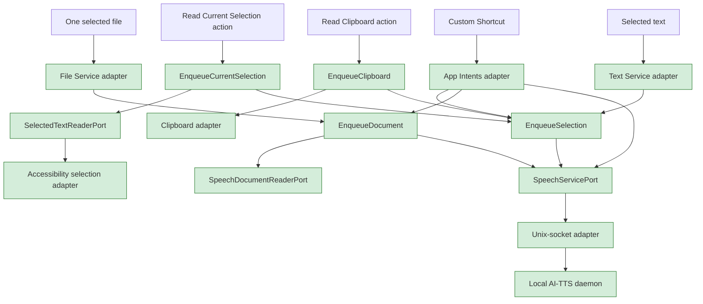

# Read anywhere on macOS

**Decision:** accepted on 2026-09-05. **Implementation status:** the shared
selected-text use case, native text/file Services, explicit Accessibility and
clipboard menu actions, and six installed, system-indexed App Intents are
implemented. Representative host, live Accessibility, and real Shortcuts
invocation acceptance remain in progress. The document distinguishes executable
behavior from future acceptance claims so that design intent never masquerades
as product behavior.

## 1. The decision in one minute

AI-TTS will integrate with macOS through several narrow, user-invoked entry
points rather than one privileged mechanism that tries to observe every app.
The primary entry point is a macOS Service for selected text. A second Service
accepts one selected text, Markdown, or text-bearing PDF file. The menu-bar app
also offers **Read Current Selection…** through the Accessibility API for
applications that do not participate correctly in Services, and **Read
Clipboard** as an explicit low-permission fallback. Six App Intent actions
extend the same application boundaries into custom Shortcuts automation.

A **Service** is an action AI-TTS exports so another application can hand it a
current selection through macOS. **Accessibility** is the separate permissioned
API that lets a trusted app inspect another app’s exposed interface elements.
An **App Intent** is a typed action macOS can make available through system
automation surfaces. These mechanisms overlap in reach, but not in authority or
reliability.

The ordering is deliberate. Services receive only the selection that the user
explicitly invokes them on and require no Accessibility grant. Accessibility
can reach some otherwise inaccessible selections, but it grants AI-TTS broader
visibility into other applications and does not work uniformly across custom
text renderers. Clipboard input is universal only after the user copies the
text. App Intents broaden automation but do not improve direct selection
handling. Therefore the direct-selection default is **Service first,
Accessibility only on demand, and clipboard only by explicit action**. App
Intents are the automation layer, not another way to inspect a highlight.

In summary, “integrated everywhere” means a predictable ladder of explicit
entry points. It does not mean continuously watching what the user highlights.

## 2. One sentence, from selection to speech

The canonical journey is intentionally ordinary: a user selects one sentence
in TextEdit and asks macOS to read it. Following that sentence exposes every
important boundary without hiding complexity behind a large document.

The selected text is:

> Deploy completed at 14:32. The cache is warm.

The user chooses **Services → Read Selection with AI-TTS**, either from the
application menu or from a contextual menu when the host application exposes
relevant Services there. They may instead assign the Service a keyboard
shortcut in System Settings. Apple documents selection-based Services, their
relevance filtering, and user-assigned shortcuts in
[Use services in apps on Mac](https://support.apple.com/en-ca/guide/mac-help/mchlp1012/mac).

The host application places that exact string on the Service pasteboard. The
AI-TTS Service adapter reads it once and hands it to the implemented
`EnqueueSelection` application use case. The use case constructs this semantic
submission:

| Field | Value | Reason |
|---|---|---|
| `text` | the exact selected string | Preserve what the user selected; trim only a copy when checking for emptiness |
| `contentFormat` | `plain_text` | A selection has no trustworthy document-format provenance |
| `voice` | unset | Resolve the current configured voice once when the daemon admits the parent utterance |
| `speed` | unset | Resolve the current configured generation speed once at admission |
| `sensitivity` | `confidential` | Selected text is private by default |
| `priority` | `normal` | OS entry points join the existing plan rather than cutting in front |
| `source` | `macos-service:text` | Make the ingress path visible without storing an application-specific policy |

The Service returns when the daemon acknowledges admission, not after playback.
The new item then behaves exactly like any other utterance: a short selection
is one clip, a long selection becomes one parent with an internal clip queue,
and the parent’s voice remains immutable across all children.

Two foils define the boundary. Selecting `salesos-history.md` in Finder is not
a text-selection request: the file Service passes its URL to the existing
`EnqueueDocument`, which classifies the `.md` extension as Markdown before
submission. Selecting text inside a custom renderer that exposes neither a
Service-compatible selection nor `AXSelectedText` is not permission to fake a
copy operation: AI-TTS reports that no readable selection is available and
offers the explicit clipboard fallback.

In summary, the selected sentence crosses one new application use case and
then rejoins the existing speech pipeline. Files remain documents, and an
unsupported selection remains an honest failure.

## 3. The ports-and-adapters shape

The OS integration belongs outside the application core. In a hexagonal
architecture, a **port** is a stable capability expressed in application
language, while an **adapter** translates one external mechanism into that
port. macOS Services, Accessibility, the clipboard, Finder, and App Intents are
therefore sibling inbound adapters; none of them owns speech policy, document
parsing, socket JSON, synthesis, or playback.

The complete intended flow is shown below. Solid green nodes exist. The paths
converge only at `SpeechServicePort`, because selected text and selected files
have different interpretation rules before that point.



<details>
<summary>Figure 1 - Native OS input adapters converge on existing speech admission</summary>

Selected text is normalized only by `EnqueueSelection`; selected files retain
the existing `EnqueueDocument` and document-reader path. Every route eventually
uses the same typed speech port and local daemon socket.

</details>

| External trigger | Inbound adapter | Application boundary | Interpretation |
|---|---|---|---|
| Selected text Service | Services provider | `SelectionEnqueueing` | Always literal `plain_text` |
| Menu-bar selection action | Accessibility reader | `SelectedTextReaderPort`, then `SelectionEnqueueing` | Always literal `plain_text` |
| Explicit clipboard action | Pasteboard reader | `SelectionEnqueueing` | Always literal `plain_text` |
| Selected Finder file | Services provider | Existing `DocumentEnqueueing` | Extension or extractor chooses Markdown versus plain text |
| Custom Shortcut | App Intent | The same selection, document, or speech-command boundary | Explicit intent parameter type chooses the path |

The core must not import `AppKit`, `ApplicationServices`, `UniformTypeIdentifiers`,
or `AppIntents`. Those frameworks stay in macOS adapters and composition. The
daemon protocol also remains unchanged: it receives text plus an explicit
content format, never a file path or an Accessibility object.

In the canonical TextEdit journey, “Deploy completed at 14:32. The cache is
warm.” follows the upper-left path from selected text to `EnqueueSelection`.
The `salesos-history.md` foil follows the file path to `EnqueueDocument`; it
never passes through selection policy.

In summary, the design adds ways into the existing hexagon rather than parallel
speech pipelines. That is what lets every entry point inherit queue ordering,
confidentiality, segmentation, voice consistency, history, and transport
semantics automatically.

## 4. Services are the primary integration

macOS Services are the least-privileged mechanism that satisfies the core
request. The source application supplies selected data only after an explicit
user command, while macOS decides whether a Service is relevant from the types
the provider advertises. AI-TTS therefore gains useful system reach without
permission to inspect unrelated application state.

The app bundle advertises two entries under `NSServices` in its generated
`Info.plist`:

| Menu title | Accepted input | Application action |
|---|---|---|
| **Read Selection with AI-TTS** | one nonempty plain-text selection | Call `SelectionEnqueueing` with source `macos-service:text` |
| **Read File with AI-TTS** | one supported file URL | Call `DocumentEnqueueing` with source prefix `macos-service:file` |

One AppKit services-provider object implements both selectors and is assigned
to `NSApplication.servicesProvider` only after its dependencies are ready.
Apple’s archived but still canonical
[Providing a Service](https://developer.apple.com/library/archive/documentation/Cocoa/Conceptual/SysServices/Articles/providing.html)
guide specifies this provider lifecycle, pasteboard invocation, `NSServices`
advertisement, and application installation model. The companion
[Services Properties](https://developer.apple.com/library/archive/documentation/Cocoa/Conceptual/SysServices/Articles/properties.html)
reference defines `NSMessage`, `NSMenuItem`, `NSSendTypes`, `NSSendFileTypes`,
and `NSRequiredContext`.

The text Service is an action, not a transformation. It reads a string and does
not replace the pasteboard contents or return transformed text. The file
Service accepts exactly one file for its first implementation, matching the
existing single-document use case and avoiding an undefined ordering contract
for multi-file selections. Unsupported types and multi-file input fail with a
clear local error rather than partially enqueueing a batch.

The guaranteed discovery surface is the application’s **Services** menu, plus
the keyboard shortcut the user may assign in System Settings. A host may also
surface the command in its contextual menu, sometimes directly and sometimes
inside a Services submenu. AI-TTS cannot guarantee a new top-level right-click
row in every application because the host owns that menu.

For the canonical TextEdit sentence, this is the whole interaction: TextEdit
provides the sentence, the Service submits it, and TextEdit remains the active
working context. Opening the AI-TTS popover is unnecessary.

In summary, Services provide the broadest clean first step: explicit data
handoff, no Accessibility prompt, typed applicability, and a native keyboard
shortcut without global key monitoring.

## 5. Selection admission is one application policy

Selected text needs its own application use case because an OS adapter must not
reconstruct submission policy. The use case is small, but it is load-bearing:
it is the only place that decides how an arbitrary selection becomes speech.

The interface is deliberately narrower than `SpeechServicePort`:

```swift
public protocol SelectionEnqueueing: Sendable {
    func enqueueSelection(_ text: String, source: String) throws
}
```

The adapter supplies only the exact text and provenance. `EnqueueSelection`
checks a trimmed copy to reject empty or whitespace-only input, but submits the
original string unchanged. It owns `plain_text`, confidential sensitivity,
Normal priority, and unset voice and speed. It then delegates exactly once to
`SpeechServicePort`.

That means the canonical sentence reaches `SpeechServicePort` byte-for-byte as
selected. The use case adds policy fields around it; it does not rewrite its
punctuation, normalize its whitespace, or pre-segment it.

This explicit policy prevents three accidental behaviors. The Service cannot
sniff `#`, backticks, or asterisks and silently reinterpret a selection as
Markdown. An Accessibility adapter cannot decide that its source application
deserves Urgent priority. A future Shortcut cannot mark arbitrary user content
public just because its implementation lives in a different target. If the
product later wants **Read Selection as Markdown**, that is a separately named
command with an explicit format, not a heuristic hidden inside this one.

In summary, adapters acquire input; `EnqueueSelection` decides what that input
means. Keeping those responsibilities separate makes every OS surface
consistent and directly testable.

## 6. Files remain documents

The file Service does not need a new file-reading design. The implemented
`DocumentEnqueueing` port and `EnqueueDocument` use case already own the
confidential, Normal-priority submission policy, and the local document reader
already projects a user-selected URL into exact source text plus an explicit
format.

The Service adapter passes the single selected URL to `enqueueDocument(at:)`.
From there, existing behavior applies:

| File | Interpretation | Failure boundary |
|---|---|---|
| `.txt` or other supported UTF-8 text | literal `plain_text` | Invalid UTF-8, empty text, or source above 512 KiB is rejected locally |
| `.md` or `.markdown` | exact source stored; Markdown AST projected for speech | Invalid UTF-8, empty text, or source above 512 KiB is rejected locally |
| text-bearing `.pdf` | native text layer in page order as `plain_text` | Reject above 32 MiB, 500 pages, or 512 KiB extracted text; locked and image-only PDFs also fail; no OCR or layout reconstruction |

The daemon still receives no path. Security-scoped access, bounded file reads,
file type handling, PDFKit, page/extracted-text ceilings, and filename
provenance remain in the native adapter. An admitted large file still becomes
one parent queue item whose child clips share one immutable voice and block
later top-level items until the document is terminal.

In summary, Finder integration is only a new trigger for the document boundary
that already exists. It must not duplicate extraction, format classification,
or socket translation.

## 7. Accessibility is an explicit fallback

The menu-bar action can improve coverage for applications whose selections do
not reach Services, but it must be treated as a privileged, best-effort
fallback. The user invokes **Read Current Selection…** first; only then may
AI-TTS request Accessibility trust and inspect one application once.

Focus timing is the subtle part. The status controller captures the previous
frontmost application’s process identifier before it shows the popover or
makes its window key. The action later creates an accessibility element for
that stored process, asks for its focused UI element, and reads
`kAXSelectedTextAttribute`. Querying the current frontmost process after the
popover activates would target AI-TTS itself.

If TextEdit did not surface the canonical sentence through Services, the user
could invoke this fallback. The same sentence would still reach
`EnqueueSelection`; only the acquisition adapter would change.

Apple defines
[`kAXSelectedTextAttribute`](https://developer.apple.com/documentation/applicationservices/kaxselectedtextattribute)
for the currently selected text, but requires it only for accessibility objects
that represent editable text. Browser renderers, PDF views, terminals, canvas
content, and custom editors may omit it. AI-TTS must therefore distinguish
permission denied, no prior application, no focused element, unsupported
selection, and empty selection. None of those errors may enqueue substitute
content.

The app checks trust with
[`AXIsProcessTrustedWithOptions`](https://developer.apple.com/documentation/applicationservices/1459186-axisprocesstrustedwithoptions)
and uses the system prompt option only after the explicit action. It does not
prompt during launch, poll selection state in the background, or imply that
granting permission guarantees compatibility.

In summary, Accessibility is useful precisely as a narrow escape hatch. Its
permission scope and uneven selection support make it unsuitable as the
default or as a continuous detector.

## 8. Privacy boundaries and rejected shortcuts

The integration must preserve the local-first posture at the moment where
private text leaves another application. Explicit invocation, minimal data
acquisition, and honest failure are therefore product behavior, not merely
implementation preferences.

| Rejected approach | Why it is rejected | Accepted alternative |
|---|---|---|
| Continuously poll Accessibility for highlighted text | Observes unrelated activity, consumes resources, and makes the enqueue moment ambiguous | Query once after **Read Current Selection…** |
| Synthesize Command-C | Depends on focus timing and causes behavior in another app | Receive the Service selection or ask the user to copy explicitly |
| Save, overwrite, and restore the clipboard | Races other clipboard users and can lose delayed or multi-format data | Read the existing clipboard without mutation only after **Read Clipboard** |
| Automatically infer Markdown from selected characters | A selection has no reliable source-format provenance | Treat selections as literal; classify selected files by document type |
| Send file paths through daemon IPC | Expands filesystem authority and forks client-side extraction policy | Read the selected URL locally and submit text plus format |
| Add a Finder Sync extension only for a context item | Adds a privileged extension and duplicates what a file Service already provides | Use **Read File with AI-TTS** as a Service |
| Claim a top-level context-menu item everywhere | Host applications own their contextual menus | Guarantee the Services-menu command and document the optional contextual placement |

**Read Clipboard** remains acceptable only as an explicit action. It reads the
current string representation, never changes the pasteboard, submits through
`EnqueueSelection`, and tells the user when no string is present. It is a
fallback for inaccessible renderers, not a hidden implementation of selection
reading.

In summary, the design does not trade privacy or state integrity for the
appearance of universality. Where macOS exposes no selection, AI-TTS asks for a
clearer user action.

## 9. App Intents extend the application into automation

App Intents are the right adapter for automation, not the first answer to
selection. They expose AI-TTS actions to the macOS Shortcuts action library,
with typed parameters for text or files. Apple’s
[App Intents](https://developer.apple.com/documentation/AppIntents/app-intents)
and
[parameter](https://developer.apple.com/documentation/appintents/adding-parameters-to-an-app-intent)
documentation establish that discovery and input model. Apple’s current
[App Shortcuts platform guidance](https://developer.apple.com/design/human-interface-guidelines/app-shortcuts#macOS)
draws an important boundary: preconfigured App Shortcuts are not supported on
macOS, while actions created with App Intents are available for people to use
in custom shortcuts. The emitted `AppShortcutsProvider` records are therefore
metadata evidence, not a promise of ready-made macOS shortcuts.

The implemented intents are **Read Text**, **Read File**, **Pause**,
**Resume**, **Skip**, and **Set Playback Speed**. Read Text delegates to
`SelectionEnqueueing`; Read File delegates to `DocumentEnqueueing`; transport
intents delegate to existing speech commands. No intent gets a private policy
fork.

The release builder compiles the Swift executable, performs a focused constant
extraction, and runs the active Xcode toolchain's App Intents metadata
processor. It validates the exact six actions, six emitted provider records,
and six playback-rate values in `Contents/Resources/Metadata.appintents` before
signing the bundle. SwiftPM compilation, bundle assembly, signing,
installation, and system indexing are verified locally. A real custom-Shortcut
invocation remains a separate acceptance boundary. The stock `shortcuts` CLI
lists and runs saved user shortcuts; it does not address an App Intent by its
Swift type name. Acceptance therefore needs one user-created shortcut
containing the installed action.

In summary, App Intents extend a finished capability into automation. They do
not replace the direct Service interaction or justify weakening the bundle
verification boundary.

## 10. What exists, what is planned, and how it was checked

The design remains ahead of the implementation in its later slices, so the
current-state ledger is part of the contract. A reader should be able to tell
which claims come from live code, which come from installed-system acceptance,
and which remain future work.

| Claim | Current evidence | State |
|---|---|---|
| Native application logic is compile-separated from macOS adapters and presentation | `clients/menubar/Package.swift`; `AITTSApplication`, `AITTSMacAdapters`, `AITTSMacEntryPoints`, and `AITTSMenuBar` targets | Implemented |
| Documents share one inbound application port | `SpeechApplication.swift` defines `DocumentEnqueueing` and `EnqueueDocument` | Implemented |
| Text and documents carry explicit content format | `SpeechContentFormat`, `SpeechSubmission`, and `SpeechDocument` | Implemented |
| Selected-text application policy exists | `SpeechApplication.swift` defines `SelectionEnqueueing` and `EnqueueSelection`; focused application tests record falsification | Implemented |
| The app advertises Services | Generated metadata and installed `pbs` discovery contain exact text and file `NSServices` entries | Implemented; installed discovery verified |
| Service requests delegate to shared use cases | Focused adapter tests plus installed `NSPerformService` text/file invocations reached exact daemon submissions without changing the general pasteboard | Implemented; TextEdit menu verified, remaining host matrix pending |
| Explicit acquisition paths share selection admission | `EnqueueCurrentSelection` and `EnqueueClipboard` delegate exact reader output through `SelectionEnqueueing`; Queue's **Read…** menu calls those ports | Implemented and contract-tested |
| The app can read another app’s selection | `AccessibilitySelectionReader` queries one explicit PID and distinguishes trust, focus, support, empty, and AX failures | Implemented; live permission/host acceptance pending |
| The prior foreground application survives popover activation | `PopoverOpenSequence` stores an external PID before its activation closure; focused tests falsify the event order | Implemented and contract-tested |
| App Intents are packaged for system discovery | Six typed intents delegate through injected application ports; the release builder validates generated `Metadata.appintents` before signing; macOS `linkd` indexed the installed URL, all six action identifiers, and six provider records | Implemented; installed system indexing verified, real custom-Shortcut invocation pending |

The repository audit read the live Swift port, composition, status-controller,
and bundle-builder code. The installed macOS SDK was also checked for
`NSServices`, `NSApplication` service-provider APIs,
`kAXSelectedTextAttribute`, and `AXIsProcessTrustedWithOptions`. Apple’s
developer and support documentation supplies the external behavioral contract;
the repository remains the authority for what AI-TTS actually implements.

In summary, the Services path has installed dispatch evidence, while its
representative host matrix remains incomplete. Accessibility and the explicit
clipboard fallback are executable and contract-tested, but live
permission/focus acceptance remains. App Intents are package-verified, with
installed system indexing verified and real custom-Shortcut invocation still
unclaimed.

## 11. Delivery order and the definition of done

The implementation should land as independently reviewable behavior slices,
each tested at the narrowest contractual boundary. This order proves shared
policy before connecting it to privileged or installation-sensitive macOS
mechanisms.

| Slice | Behavior | Required proof |
|---|---|---|
| 1. Selection use case | Exact nonempty text becomes one confidential, Normal, literal submission | Small application-port tests with recorded falsification of every new load-bearing assertion |
| 2. Text and file Services | Generated bundle advertises both commands; providers delegate once to the correct use case | Bundle/plist contract tests, adapter tests with owned pasteboards, installed Services discovery |
| 3. Native acceptance | Selection and file requests enqueue through the installed app without clipboard mutation or Accessibility prompt | Manual matrix across TextEdit, Safari, a Chromium app, VS Code, Preview, and Finder; record host limitations honestly |
| 4. Accessibility fallback | Explicit menu action captures the prior app and reads one selection after trust | Port/adapter tests plus permission-denied, unsupported-element, empty-selection, and focus-transfer acceptance |
| 5. App Intents | Custom Shortcuts automation delegates to existing use cases | Installed metadata discovery and real custom-Shortcut invocation from a checkout-independent signed bundle |

The first goalpost is complete when all of the following are true:

- **Read Selection with AI-TTS** appears for compatible text selections in the
  Services menu and works through an assigned keyboard shortcut.
- **Read File with AI-TTS** accepts exactly one supported Finder selection and
  rejects unsupported or multiple selections without partial admission.
- The selected-text Service submits the exact text as confidential, Normal,
  literal plain text and returns after daemon acknowledgement.
- The selected-file Service uses the existing document boundary, including
  Markdown AST projection, PDF limits, nested segmentation, and one immutable
  voice per parent.
- Invoking either Service neither requests Accessibility trust nor changes the
  clipboard.
- No documentation promises top-level contextual-menu placement in every app.
- Compatibility gaps are recorded before deciding whether the Accessibility
  slice earns its permission cost.
- The release bundle’s generated metadata, signature, installed discovery, and
  checkout independence are all verified at the exact commit being shipped.

In summary, “done” is an installed, observable OS contract—not merely Swift
types that compile. Each entry point earns its compatibility claims only with
evidence from the system surface that actually invokes it.
