# AI-TTS — menu bar UI design

Status: **draft for review**. No application code exists yet and none should be written from this document until it has been reviewed. These are hand-authored SVG mockups plus the reasoning behind them; where I made a choice that could reasonably have gone the other way, the reasoning is written down so it can be argued with rather than discovered later in code.

All mockup content is invented. The utterances are the kind of thing an agent says, not anything real.

## How to read the mockups

Six SVGs live in [`mockups/`](mockups/). Panel views are drawn at the real proportions of a macOS menu bar popover: a 360 × 480 pt panel with a 12 pt corner radius and the small arrow that points at the tray icon, inside a 368 × 500 canvas so the arrow has room. Type sizes, hit targets and paddings are the numbers I would actually build to, not approximations — 11 pt for chrome, 12 pt for list rows, 13.5 pt for the utterance you are currently listening to.

### Light and dark: one file per view, not two

Each SVG carries **both themes in a single file**. A `<style>` block defines the light palette as CSS custom properties on `svg`, and an `@media (prefers-color-scheme: dark)` block redefines the same properties. Every shape references a property through a class.

I chose this over shipping twelve files — a light and a dark variant per view — for one reason: **two files drift**. Every content change would have to be made twice, and the first time someone fixes a truncation in the light variant only, the pair silently stops describing the same product. One file cannot disagree with itself.

The cost of that choice is that some SVG consumers do not implement CSS. So every themed element also carries a **presentation attribute holding its light value** (`class="acc" fill="#0A6CFF"`). CSS beats presentation attributes in the cascade, so a renderer that understands the stylesheet gets the themed result and a renderer that does not gets a correct light rendering. This is not speculative — I tested both paths:

| Renderer | Result |
|---|---|
| Chrome 1xx (headless) | Honours the custom properties and the media query. Dark renders correctly. |
| librsvg 2.62.3 (`rsvg-convert`) | Ignores the custom properties entirely and renders from the presentation attributes. Correct light output, no missing shapes. |

Every file was checked with `python3 -c "import xml.dom.minidom,sys; xml.dom.minidom.parse(sys.argv[1])" <file>`; all six parse.

No external references, no raster images, no web fonts. Type is `-apple-system, system-ui, sans-serif` set as a presentation attribute on the root group so it survives even when the stylesheet does not.

---

## The model behind the views

The app owns **two queues and one plan**, and that distinction drives almost every layout decision below.

- The **synthesis queue** is a *work* queue. It answers "what is the machine busy with, and is it keeping up?" Its natural sort is by processing order, and its interesting facts are progress, cost and failure.
- The **playback queue** is the *speaking plan*. It answers "what are you going to say to me, and in what order?" Its natural sort is the order you will hear things in, and its interesting facts are position and readiness.

The same utterance appears in both, framed differently. This is why the playback queue shows items that have not been synthesized yet, marked `waiting for synthesis` — the brief asked to "view upcoming things you had to say", and the honest answer to that includes everything scheduled, not only the subset that happens to be cached. A playback queue that hides un-synthesized items would make the machine's internal scheduling visible as a gap in your plan, which is exactly backwards.

Playback is **strictly serialized**: one utterance at a time, never overlapping, no mixing. Synthesis is not — the model stays hot and generates ahead of playback, which is the whole point of splitting the queues.

---

## 1. Now Playing — the default view

**What it is for.** This is what you get when you click the tray icon, and for most clicks it is the only view you need: *what is being said right now, how far in are we, make it stop.*

The utterance text is set at 13.5 pt — larger than any list row in the app — because when you open this panel mid-sentence you are usually trying to read the part you just missed. **Text already spoken is dimmed and text not yet spoken is at full contrast.** That is a cheap approximation of karaoke highlighting that needs only a character offset from the player, no forced alignment, and it turns the panel into a reading aid rather than a decoration.

**Interactions.** Scrub by dragging the progress knob. Rewind, play/pause, skip (see [the interaction model](#the-interaction-model) for what rewind means). The `1.0×` chip cycles common speeds on click and opens the full slider on long-press. The speaker icon mutes without pausing — the queue keeps draining, which is what you want when someone walks up to your desk. The gear pushes [Settings](#5-settings). The two Up Next rows are a peek, not a list: ⌥-click plays one immediately, plain click opens the full queue.

**Empty state.** Header status reads `Idle`. The utterance area is replaced by a single centred line — "Nothing to say right now" — with the last spoken item underneath as a dimmed row and a replay button, because the most common reason to open an idle panel is "what did it just say?". Below that, one line of instruction on how to send text. The transport controls are present but disabled, not removed; a control that disappears makes the panel feel like a different screen.

**Error state.** A synthesis failure never reaches this view — it cannot play, so it stays in the synthesis queue as `Failed`. The error this view *can* show is an **output** failure: the audio device vanished mid-utterance (headphones unplugged, a Bluetooth device dropped). Then the progress bar turns red, the elapsed time freezes, and a single-line inline strip appears above the transport: "Output device unavailable — playback held at 0:07 · Retry". The utterance is not skipped and not marked spoken. Losing a device is not the same as being told something, and the queue must not drain into a disconnected speaker.

---

## 2. Synthesis queue

**What it is for.** Answering "is it keeping up, and did anything break?" State is carried by a coloured pill on the right of each row — `Generating`, `Queued`, `Ready`, `Failed` — rather than a left-hand icon, because the pill can hold a **word**. Colour alone is not a state; the accessibility cost of a bare coloured dot is real and the horizontal space cost of the word is about 48 pt.

The generating row is the only one that gets extra height, for a determinate progress bar and an estimate. Everything below is one line of text plus one line of metadata — deliberately terse, because this is a monitoring view and rows here are scanned, not read.

Completed items are pushed below a `COMPLETED THIS SESSION` divider rather than removed. An item that finished synthesis has *left* this queue conceptually, but making it vanish destroys the only place you can see that synthesis is working at all. The footer states the fact that justifies the whole architecture: `Model hot · bm_daniel · 0.42× realtime`.

**Interactions.** `Pause synthesis` stops the generator without touching playback — useful when you want the CPU back but do not want to lose the queue. `Retry` on a failed row re-enqueues it at the head. Clicking a row reveals the full text. Failed rows can be dismissed; queued rows can be cancelled.

**Empty state.** "The queue is clear." plus the model's hold state — "Model stays hot for another 4m 12s" — because the interesting question when this queue is empty is whether the *next* item will be fast or will pay the cold-start cost.

**Error state.** Two distinct classes, and they must not be conflated:
- **Per-item failure** (shown): a `Failed` pill, the reason in red where the metadata line would be, and `Retry`. Other items keep processing.
- **Generator failure**: the model itself did not load or has died. Nothing can synthesize, so a full-width banner replaces the toolbar — "Voice model failed to load — bm_daniel · Reload" — and every queued row greys out. Marking twelve rows individually failed when one shared dependency broke is noise; one banner is the truth.

---

## 3. Playback queue (Up Next)

**What it is for.** The order you are going to hear things in, and rearranging it.

The currently playing item is row zero, highlighted with the accent tint and an accent bar, carrying its own inline progress — this is the Music.app pattern, where the up-next list highlights the current track while the player bar persists at the bottom. I kept the docked mini transport at the bottom of this view (and of History) so that pause is reachable from every tab without navigating back. The mild redundancy between the highlighted row and the dock is worth it; requiring a tab change to pause is not.

Per-row actions — play now, move to top, remove — appear **on hover** (row three is drawn in that state) rather than permanently. Four rows each showing three buttons turns a list you scan into a control panel you parse. Reordering is drag-and-drop via the grip; the grips are always visible because an affordance that only appears on hover is an affordance nobody discovers.

Note rows four and five: an item mid-synthesis (`generating · 62%`) and an item not started (`waiting for synthesis`). They hold their position in the plan while the machine catches up.

**Interactions.** Drag to reorder. Hover for actions. ⌥-click plays a row immediately, moving the current utterance back to position one rather than discarding it. `Clear queue` empties everything *after* the current utterance — it deliberately does not stop what is being said, because "stop talking" and "cancel the backlog" are different intentions and one control should not do both.

**Empty state.** "Nothing queued." with the currently playing item still shown above it if there is one, and a link to History. If nothing is playing either, the whole panel collapses to the same idle state as Now Playing.

**Error state.** The interesting failure here is an item whose cached audio has gone — evicted by the retention policy, or deleted underneath us. The row shows `audio no longer cached` with a `Re-synthesize` action instead of a duration. The queue does not silently drop it, and it does not stall on it: if playback reaches such a row it re-synthesizes on demand and shows the generating state inline.

---

## 4. History

**What it is for.** "It should all be there." History is the durable record of everything spoken, and it is the reason cached audio is worth keeping at all.

Rows are grouped by day, timestamped in a fixed left column so the eye can scan times without reading text, and each carries a replay button. The first entry demonstrates truncation: two lines, then an ellipsis. Two lines is the cap — enough to identify an utterance, not enough for a long report to push everything else off screen. Clicking a row expands it to full text in place.

Search is the primary control and sits at the top. This is a log that grows without bound; browsing it chronologically stops working within a week, and the actual use is "what did it tell me about the migration".

**Interactions.** Search filters live across all days. Replay puts the utterance at the head of the playback queue rather than playing it over the top of what is speaking — playback stays serialized, always. Right-click gives copy text, reveal cached audio in Finder, and delete. `Export…` writes the visible (filtered) set as JSON or plain text.

**Empty state.** Two different empties, and they must read differently. No history at all: "Nothing spoken yet" with the send instruction. No search results: "No matches for 'migration'" with a clear-search affordance and the total count so you know the store is not empty.

**Error state.** History is the one part of the app that should never lose data, so its error is a store-level one: "Could not read the history store" as a banner, with a reveal-in-Finder action. Individual rows also carry two non-fatal states worth showing: `skipped at 0:07 of 0:29`, and `audio expired` where the text remains but the replay button is replaced by `Re-synthesize`.

---

## 5. Settings

**What it is for.** The brief called out that voice selection should live in the app rather than being a shell flag, so this is a pushed subview reached from the gear, not a separate window. Everything here takes effect immediately; there is no Apply button, and `Done` only dismisses.

Voices are **radio rows, not a dropdown**. There are four; a popup would hide three of them behind a click and hide the descriptors entirely. Each row carries a preview button, because a voice name is not a voice — `bf_isabella` versus `bf_alice` is unanswerable without hearing them, and the model is already hot, so a preview costs a fraction of a second.

Speed is a slider with a numeric readout rather than presets, and it is labelled `1.00×` with two decimals to signal that it is continuous.

Storage separates the two things that actually differ: text history is small and kept, cached audio is large and prunable. The retention popup and the usage bar sit together so that "keep 30 days" and "412 MB of 2 GB" can be read as one sentence. `Clear cache` is styled destructive; it never touches history text.

**Interactions.** Select a voice, preview a voice, drag speed, pick an output device, toggle autoplay, set retention, clear the cache. The scroll indicator on the right edge is drawn deliberately — the content is slightly taller than the popover and I would rather show that honestly than shrink the type.

**Empty state.** None; a settings panel always has settings.

**Error state.** Two inline, non-modal failures. A voice that fails to load shows the error on its own row and **selection reverts to the last working voice** — an app that ends up with no usable voice because you clicked the wrong radio is a broken app. A device that disappears is shown in the popup as "MacBook Pro Speakers (unavailable)" with automatic fallback to the system default, and a one-line note saying that fallback happened. Silently redirecting audio to a different speaker is how you say something out loud in a meeting.

---

## 6. Tray icon states

Drawn as a proper **template image**: one colour plus alpha at 18 × 18 pt, so macOS tints it for light and dark bars, for the vibrancy behind it, and for the inverted look when the menu is open. The sheet shows all five states at 4× and at actual size in both bars.

The family is **one container and five marks** — the speech bubble never changes, only what is inside it. That gives the set a single silhouette to recognise at 18 pt while keeping the states distinguishable by their interior.

- **Idle** — the only *outlined* state. Weight alone answers "is it doing anything" before you resolve the glyph.
- **Synthesizing** — three dots. The universal "composing" idiom.
- **Playing** — waveform bars.
- **Paused** — pause bars.
- **Error** — an exclamation mark.

Only synthesizing and playing animate (dots cycling, bars rising and falling), so **motion in the menu bar always means work in flight**, and stillness always means it is waiting on you or on nothing. Error is sticky: it persists until you open the popover, because an error that clears itself after five seconds is an error you will never see.

I deliberately did not add a numeric badge for queue depth. At 18 pt a badge is either illegible or it deforms the silhouette, and the count is one click away.

---

## The interaction model

### What happens on skip mid-utterance

Skip stops the current audio immediately — with a ~40 ms fade, because cutting a waveform at an arbitrary sample produces an audible click — and starts the next item.

**The skipped audio is not discarded.** The utterance is recorded in history as `skipped at 0:07 of 0:29`, the cached file stays, and the replay button works. This follows from what skipping actually means: almost always "not now", very rarely "never". An implementation that deletes the audio and drops the history entry optimises for the rare reading and makes the common one unrecoverable. Skip is a playback decision, not an editorial one.

Skip never reaches into the synthesis queue. If you skip an item that is still generating, generation continues and the item lands in history as spoken-never, ready to replay. Cancelling generation is what `Cancel` on the synthesis row is for.

### What "rewind" means

**My position: one press restarts the current utterance. A second press within two seconds, or a press when already at the start, goes to the previous utterance.** ⌥-click jumps back five seconds.

The argument, since this is the decision I most expect to be challenged:

*Why not jump back 15 seconds, like a podcast player?* Because that idiom exists for long-form audio where 15 seconds is a small fraction of the content. Here the median utterance is ten to thirty seconds. A 15-second jump is either most of the utterance or all of it, so the control's behaviour would swing wildly depending on the length of what happens to be playing — sometimes a nudge, sometimes a restart, sometimes a jump into the previous item's silence. A control whose meaning depends on content length is a control you cannot build a reflex around.

*Why not always go to the previous utterance?* Because the overwhelmingly common trigger is "I missed that, say it again", and that is the current item, not the one before it. Making the previous item the primary action means the common case takes two presses and overshoots on the first.

*Why the layered rule?* Because it is exactly the rule every music player has used for twenty years, and it is already in the user's fingers. The only twist here is what "previous" means when the previous item has already been consumed: **it is pulled back out of history onto the head of the playback queue**, and the item that was playing is requeued behind it. Nothing is lost and the plan stays coherent.

*Why keep a 5-second jump at all?* One real case survives the argument above: a number or a name went past and you want it again without hearing the preceding twenty seconds. That is a genuine need but a secondary one, so it gets a modifier rather than the button.

### Priority and interruption

New items **append**; they never interrupt. An agent that can barge into the middle of a sentence makes the app unpredictable in exactly the situations where predictability matters — a call, a meeting, a conversation. If a priority lane is wanted, my proposal is that a priority item inserts at the *head of the queue* and starts when the current utterance finishes, rather than cutting it off. True barge-in is an [open question](#open-questions-for-review).

### How the tray icon communicates state at a glance

The icon answers three questions in decreasing order of urgency, without a click:

1. **Is it doing anything?** Outline versus filled.
2. **Is it about to talk, or talking?** Dots versus bars — the difference between "audio is being prepared" and "audio is coming out of the speakers right now", which matters when you are deciding whether to put headphones on.
3. **Did something break?** The exclamation mark, sticky until acknowledged.

State precedence when several are true at once, since this is the part that gets fumbled in implementation: **error > playing > paused > synthesizing > idle**. Playing outranks synthesizing because playing is the state with an external consequence — sound in the room. Paused outranks synthesizing for the same reason inverted: if you have deliberately held playback, the icon must keep saying so even while the generator works in the background, or the app will look like it ignored you.

---

## Open questions for review

1. **Barge-in.** Should a priority item ever cut off what is currently being said? I have argued no, and proposed head-of-queue insertion instead. If yes, it needs a distinct visual state and probably a distinct sound.
2. **Input transport.** The mockups show a source chip (`claude-code`, `calendar-watch`), which assumes senders identify themselves. Is that a CLI argument, a Unix socket, or localhost HTTP — and if sources are a real concept, do you want per-source mute or per-source voice?
3. **Retention defaults.** I assumed history text is kept forever and cached audio is prunable, defaulting to 30 days with a 2 GB cap. Is a size cap or an age cap the primary control? Showing both may be one knob too many.
4. **Crash behaviour.** If the app dies mid-utterance, on restart should the queue resume, resume from the start of the interrupted item, or stay paused and wait for you? I lean toward staying paused — waking up to a machine talking is bad.
5. **Global hotkeys.** Pause is the one control with real urgency and it currently costs a click on a 22 pt target. Is a system-wide hotkey for pause/skip worth the entitlement and the conflict surface?
6. **Detachable window.** History outgrows a 360 × 480 popover quickly. Should History open in a real resizable window, or is search enough?
7. **Speed scope.** Global only, as drawn, or a per-utterance override so an agent can mark something as urgent-and-fast?
8. **Voice list.** Four voices are hardcoded in the mockup. Discovered from the model's voice directory instead? If so, where do the human-readable descriptors ("British · male · low, calm") come from?
9. **Default tab.** Now Playing is the default. When nothing is playing, should the popover open on Up Next — or on History, which is where an idle click usually wants to go?

## What is deliberately not designed here

Onboarding, Notification Center integration, per-app volume, multi-device output, and any preferences window beyond the popover subview. All of these are plausible and none of them are needed to answer whether this app's core interaction is right.
