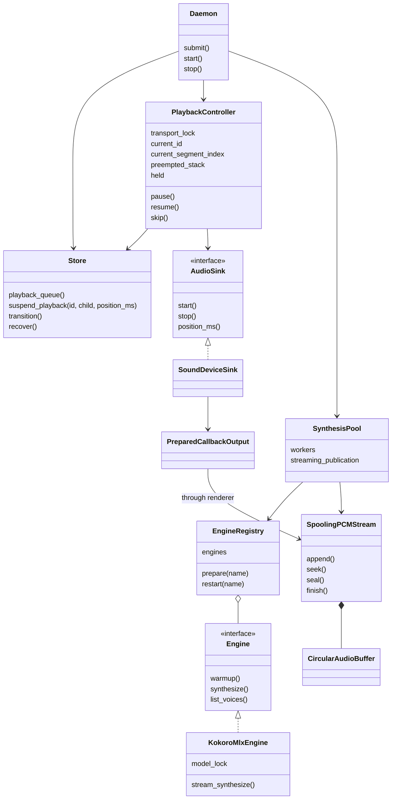
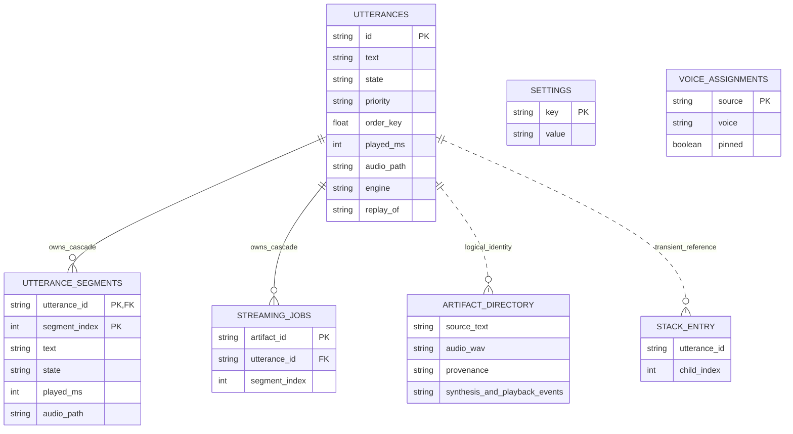
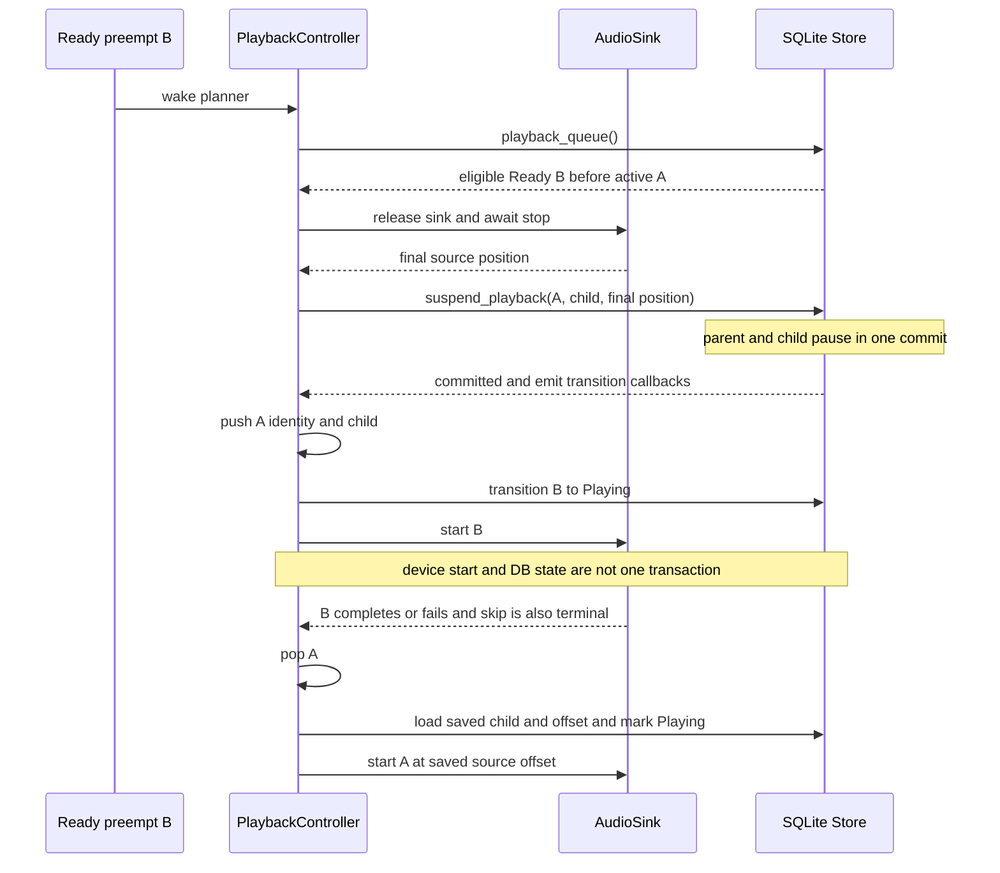
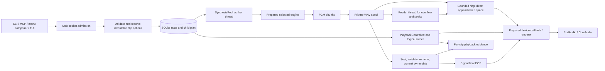
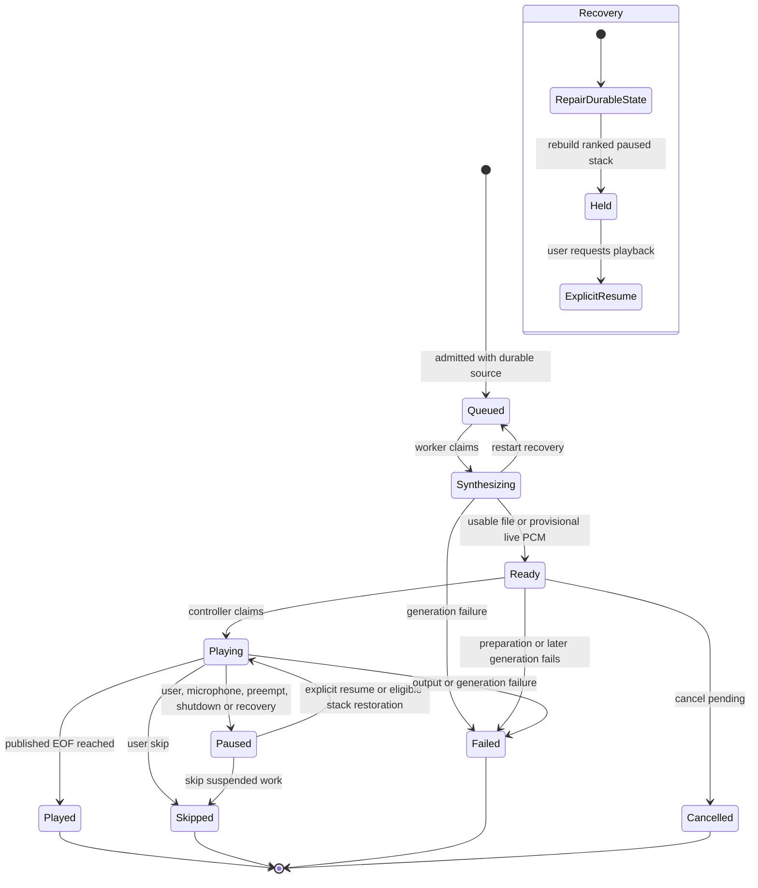
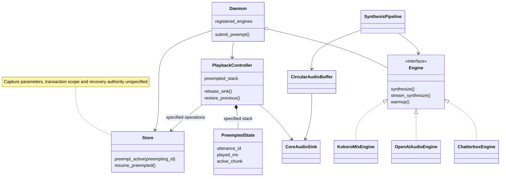
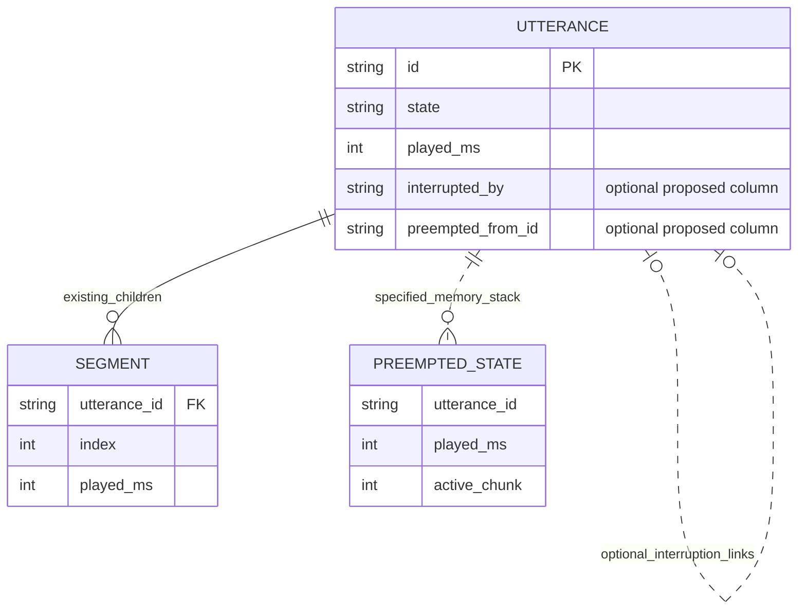
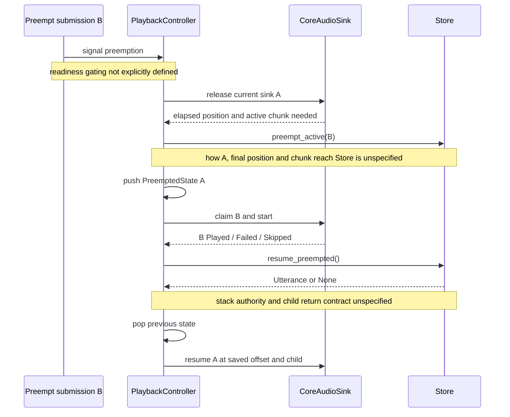
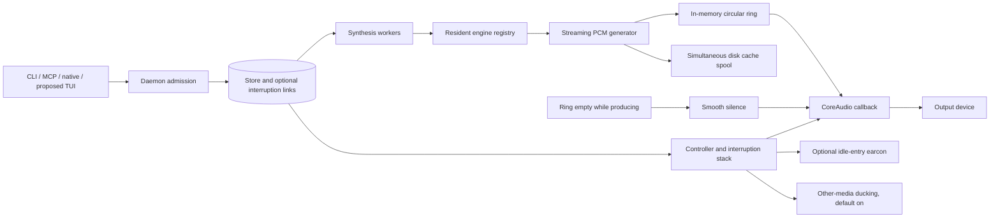
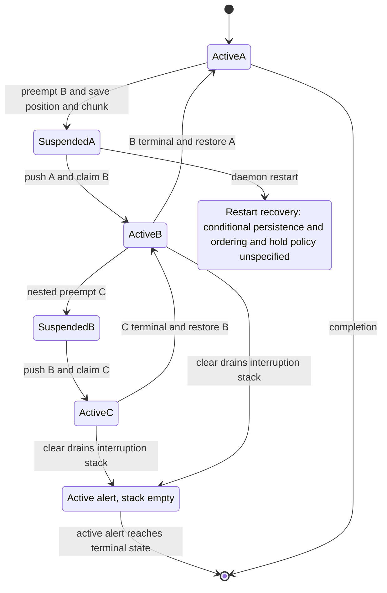

# AI-TTS: implemented architecture versus the proposed design

Date: 2026-09-30. Change-kind: **feature** (benchmark instruments and review;
no runtime behavior change). Implementation reviewed:
`0290f3cf3a0c3930256f42f31500bda59c1eabeb`, the integrated seven-prompt stack.
This is a review of that source snapshot, not a claim that the installed app or
current `main` contains every change.

Subsequent user acceptance: see the maintained
[delivery decision](../design/2026-09-30-architecture-acceptance.md). It resolves
the controller-ownership and reviewed MLX-footprint choices only; historical
measurements and other acceptance gaps below remain unchanged.

## Findings and decision

The current design preserves the important separation: synthesis can run ahead,
while one playback controller owns the output device. Its interruption handoff
is fast in the owned controller/SQLite experiment, but grows with ready-queue
size: median takeover rises from **0.249 ms at zero background clips to
1.063 ms at 256**; restoration rises from **0.304 to 1.923 ms**. These are
control-plane timings, **not time to audible speech**.

The proposed design does **not** eliminate the controller stack. Prompt 1
explicitly requests both a stack and Store methods named `preempt_active` and
`resume_preempted`. The substantive choice is how much interruption policy and
causal state to place in the Store. Explicit durable interruption relationships
could improve recovery semantics, but the prompt leaves them optional and does
not define transaction boundaries. Renaming methods alone establishes neither
better correctness nor better performance.

The MLX memory prediction is contradicted by this configuration's measurement:
**994.27 MiB process RSS after warmup and ten idle seconds**, and **1,005.17 MiB
after repeated synthesis and another ten idle seconds**. MLX active allocation
alone is **312.55 MiB**. The proposed ~180 MB footprint is not an achieved
acceptance result. Repeated warm synthesis is fast (median **94.54 ms**, RTF
**0.0259**) for the specified eight-word input; that does not imply sub-150-ms
end-to-end audible latency.

**Recommendation:** retain device ownership and final-playhead capture in the
controller. Before deciding on a Store-centric redesign, specify an explicit
suspension record, authoritative nesting order, transaction boundaries and
restart policy. If queue scaling matters, first evaluate a bounded candidate
query against this baseline. Neither a rewrite nor a requirements waiver is
implemented by this report. The planned architecture has no measured numbers.

## What counts as “planned”

The comparison uses the local, user-owned `PROMPTS.md`, especially prompts 1–3,
with all seven covered in the matrix below. Its SHA-256 at review time is
`1a41c228d0a5fb5d6671806f3cf44abb289a4c3f220be088b8a9e26529c20db9`.
It is intentionally left untracked and unmodified. The following specification
extract records the relevant commitments so this review remains understandable
without that local file:

- Prompt 1: `preempt_active(preempting_id)` and `resume_preempted() -> Utterance | None`;
  optional `interrupted_by` / `preempted_from_id` persistence; an explicit
  controller stack; save exact elapsed milliseconds and child index; restore
  after Played, Failed or Skipped; clear drains nesting; clean sink teardown.
- Prompt 2: local cached MLX Kokoro, priming warmup, optional backend with graceful
  fallback, approximately 180 MB memory and 0.05 real-time synthesis factor.
- Prompt 3: generator → bounded PCM ring → device callback, simultaneous disk
  spooling, underrun silence, retained artifact equal to generated audio,
  under-150-ms time to first audio.
- Prompts 4–7: resident engine registry and compatible local speech endpoint;
  optional earcon and other-media ducking; socket-based terminal dashboard;
  paragraph-aware navigation below the old 180-word threshold.

The maintained [architecture specification](../design/architecture.md) supplies
shared product invariants but has evolved with implementation. It is not treated
as an untouched historical proposal. In the planned diagrams, **specified**
means present in the prompts; **optional** means conditional in the prompt;
**unspecified** means a decision still required. Hypothetical improvements are
identified as such, never credited as implemented guarantees.

## 1. Architecture as written

### Component and class responsibilities

These are selected real types, not an exhaustive symbol index. Engine adapters
share the `Engine` contract; streaming is an optional capability. The native
menu app and TUI are clients of the same daemon rather than competing audio
owners. The Store persists lifecycle; the controller decides interruption and
captures physical progress.



### Persisted entities and transient ownership

Fields shown are a relevant subset. `replay_of` is a logical reference, not a
SQLite foreign-key constraint. `streaming_jobs.segment_index` is nullable;
its parent reference is enforced, not a composite child foreign key. Stack
entries are **in memory**, unlike the tables. Artifact directories/evidence
are filesystem records, joined by clip/artifact identity rather than SQL FKs.



### Actual interruption sequence

A preempt request must have usable audio and rank before the active item. Normal
urgent priority changes queue position; it does not interrupt. The stack stores
identity/index; the Store owns saved offsets. The final offset is captured
**after** releasing/draining the sink, avoiding the stale pre-stop playhead.



The transport lock serializes controller controls; code rechecks the global
hold after awaited release. This prevents microphone/manual pause being undone
by a takeover that was already in flight. It does not make SQLite and CoreAudio
one atomic system.

### Actual data and execution flow



`append()` writes the spool before making the new frames available; disk is not
on the callback thread, but disk latency can delay new PCM becoming readable.
The fast path feeds the ring directly; overflow and seek refill read the spool.
The producer does not wait for a paused consumer. This bounds PCM RAM rather
than total disk usage. File-only engines and incompatible cached WAVs retain a
separate file-output path. The physical silent device can stay prepared across
logical clips, reducing reacquisition work at the cost of idle device residency.

### Actual lifecycle and recovery

This is a focused state projection; `model.py` defines all permitted transitions.
Global hold is orthogonal to clip state and nesting, not a second spelling of
Paused. A composite parent's readiness requires its first playable child, not
all synthesis to finish.



On restart, current implementation reconstructs paused nesting from durable
`order_key`, not timestamps. That avoids wall-clock rollback/ties but makes
queue ranking an implicit encoding of interruption ancestry. Recovery deliberately
stays silent. Persisted offsets are checkpoints: a process killed while audio
continues after its last checkpoint cannot recover an unsaved physical position.

## 2. Architecture as planned

### Planned components and class allocation

The original prompts do not propose moving audio I/O into SQLite. Both controller
stack and Store domain operations are specified. Their division of authority is
the ambiguity to resolve, not a reason to silently remove one from the diagram.



### Planned entity relationships

Base parent/child data is inherited. The two interruption columns are optional
in the prompt. Arrow meaning below is an **illustrative interpretation**:
`A.interrupted_by = B`, `B.preempted_from_id = A`. The prompt does not define
cardinality constraints, stale-link cleanup, cycle prevention, or whether both
links are necessary. It supplies no separate durable stack table.



Explicit relationships could separate causal nesting from mutable presentation
order. Two reciprocal nullable links also create additional inconsistency cases:
one side committed, stale terminal target, cycles, deleted ancestor. A single
normalized suspension relation with an explicit order might be preferable, but
that is a **new design option**, not what was already specified.

### Planned sequence, including missing handshakes



This is an interpretation of the requested responsibilities, not executable
pseudocode with hidden guarantees. For example, `preempt_active(B)` alone cannot
capture the final hardware playhead without an additional argument, a prior
write, or an undesirable Store dependency on the device. The plan also leaves
open whether selecting B and pausing A belong to one transaction.

### Planned streaming and control flow



The proposal does not specify full-ring policy, long-pause retention, backward
seek refill, crash recovery of unfinished streams, or the publication-to-EOF
barrier. Those omissions matter: blocking the producer couples it to playback;
dropping samples corrupts speech; retaining all samples in RAM removes the
memory bound. The written implementation chooses bounded RAM plus disk backlog.

### Planned state view



These states describe roles in a nesting scenario, not new `State` enum values.
The current application already has a conservative no-surprise-speech recovery
policy; a redesigned implementation should preserve it explicitly rather than
infer automatic restart speech from “resume preempted.”

## 3. Performance and correctness tradeoffs

No credit is awarded for sunk implementation cost or existing functionality.
The following compares consequences of responsibility and data choices.

| Concern | Written design: advantage | Written design: cost/risk | Planned design: potential advantage | Planned design: cost or missing proof |
|---|---|---|---|---|
| Device authority | One controller captures actual post-stop playhead | Multiple await/DB/device phases require careful reconciliation | Same controller ownership can be retained | Store API lacks final position/child handshake |
| Durable suspension | Parent and child offsets pause in one transaction; callbacks follow commit | Alert claim and physical start remain separate | A domain command could validate victim, candidate and causal edge together | Atomicity is not specified by the method names; audio cannot join SQLite transaction |
| Nesting and recovery | Small identity/index stack; offset authority stays in Store | Restart infers ancestry from rank; explicit reason/edge absent | Explicit edge/order could preserve ancestry independent of queue edits | Optional columns plus memory stack risk two authorities; cycles and cleanup need rules |
| Queue cost | Simple public queue projection | Materializes eligible queue on planning passes; observed scaling | A bounded, indexed candidate query could reduce row decoding | Proposal has no query/index design; cannot claim better complexity yet |
| Streaming startup | Prepared callback and direct ring fast path | Warm device residency; first inference and WAV write still on critical path | Direct generator-to-ring path targets low startup latency | Full-ring and disk-failure policies unspecified; <150 ms not proven |
| Long pause / seek | Producer continues into spool; callback never reads disk | Disk capacity and feeder lifecycle become correctness dependencies | Simpler RAM-only path for short bounded clips | Long holds require blocking, dropping, or more storage unless augmented |
| Completion truth | Publish and DB ownership precede final EOF | Multi-resource failure cleanup and recovery journal needed | Simpler raw producer-complete signal | Could report Played for an uncommitted/missing artifact unless barrier specified |
| Models | Per-backend preparation and locks; next-clip selection | Multiple resident engines consume additive memory; warmup does not imply low RSS | Native MLX avoids reference-engine execution overhead | 180 MB assertion lacks measurement; fallback can change memory/latency substantially |
| Audio smoothness | Source and device underflow evidence; fades; isolated callback path | Runtime locks, GIL, driver and route changes remain outside controller benchmark | Smooth underrun silence is explicitly required | That requirement alone does not prove pop-free hardware transitions or model audio |

### Review across all seven prompts

| Prompt | Written implementation and deviation | Performance/correctness consequence |
|---|---|---|
| 1. Preemption | `suspend_playback(id, child, position)` plus controller stack; no proposed Store command pair or interruption columns | Explicit physical-position input and atomic pause; implicit recovery ancestry; benchmark focus here |
| 2. MLX | `KokoroMlxEngine`, offline prepared assets, finite mono validation, model lock, optional fallback | Measured fast short inference; ~1 GiB process RSS, not 180 MB; adapter alone is not multi-model daemon memory |
| 3. Streaming | Bounded ring plus private spool, feeder, publication barrier and prepared callback | Addresses long holds/seek and truthful completion; disk/storage lifecycle costs; actual TTFA previously 194–205 ms, accepted separately from the target |
| 4. Engines | `EngineRegistry`, local compatible endpoint validation, Chatterbox adapter, per-item engine identity | Avoids reloading merely to change default; resident models accumulate memory; admission/render-time privacy checks matter more than dict layout |
| 5. Cue/ducking | Optional earcon; native process tap for other apps; persistent default-on ducking preference | Adds cue delay when enabled and native route/permission failure modes; lowering device master volume would also lower speech |
| 6. TUI | Optional Textual socket client, terminal events and meter | Client lifetime does not own playback; event/render costs are not in the controller microbenchmark |
| 7. Paragraphs | At least 60 words enables paragraph grouping with 20-word minimum groups, preserving long-input bounds | More chunks improve navigation and earlier readiness; more engine invocations/joins can affect prosody and throughput; defaults differ from the prompt's illustrative 40-word minimum |

Relevant code: [controller](../../src/aitts/playback.py),
[Store/schema](../../src/aitts/store.py), [state model](../../src/aitts/model.py),
[streaming](../../src/aitts/streaming.py), [synthesis](../../src/aitts/synthesis.py),
[callback adapter](../../src/aitts/adapters/callback_output.py),
[engine registry](../../src/aitts/engines/registry.py),
[MLX adapter](../../src/aitts/engines/kokoro_mlx.py),
[segmentation](../../src/aitts/segmentation.py).

## 4. Executable benchmark design

The [benchmark package](../../scripts/benchmarks/) contains runnable experiments,
not only suggested cases. All state, WAVs and database faults are owned temporary
resources. It does not contact the installed daemon or play speech. The reference
and candidate use the **same harness, interpreter and dependency environment**;
implementation selection happens before application imports. This isolates
source changes, not dependency-upgrade regressions.

| Family | Workload / manipulated variable | Oracle and observations | Explicit exclusions |
|---|---|---|---|
| Golden control | Ready backlogs 0/32/256; single and nested preemption; 100 measured cycles after 10 warmups per case | Exact clip, child 1, offsets 375 ms/125 ms, zero sink overlap; wall/CPU distributions, SQL statements/commits | Engine time, actual callback scheduling, speaker latency |
| Holds | Manual and microphone interruption; Ready alert waits until explicit resume | Hold remains authoritative; exact restored child/offset | OS microphone permission/device activity detection |
| Failure endings | Inner and outer alert each Played/Skipped/Failed | LIFO restore of B then A through public controller and owned sink | Full physical-device failure matrix |
| Store fault | Inject failure immediately before suspension commit | Entire parent and children unchanged, including independently reopened reader | Torn sectors, ambiguous successful commit, controller-level DB-error containment |
| Restart | SQLite backup while nested interruption is active; recover into a new held controller | Silent until resume, highest-ranked active alert, both saved offsets and child, zero overlap | Actual SIGKILL/power loss; arbitrary crash points; unsaved device progress |
| Soak | Five minutes, 20 intended arrivals/s, depth-two interruptions; alternate terminal endings; hold every tenth arrival | Same semantic checks throughout; fixed intended arrival times, completion count/lateness, RSS checkpoints, DB/WAL size | Workday-duration hardware reproduction or concurrency schedule exploration |
| PCM | Real spool/feeder/ring; 2 seconds PCM into a 100 ms ring while consumer held; drain, seek to 375 ms | Every byte preserved through overflow and cache; correct seek samples/source clock; starvation not EOF; producer/drain/seek distributions | Audibility, model pronunciation/distortion, device-driver underruns |
| Native MLX | Offline cached bf16 model; 30 file syntheses then 30 streaming syntheses; eight-word sentence; 10-second idle phases | Nonempty 24 kHz mono WAV/PCM, adapter timings, process RSS and separate allocator gauges | Playback, acoustic latency, multi-model residency, alternative model builds |

The soak records scheduled arrival lateness even when completion falls behind;
it does not silently discard delayed requests. It serializes each semantic
journey, so it is **not** a concurrent load-generator throughput capacity test.
Latency samples flush to JSONL every 100 arrivals; FakeSink start history is
trimmed, and resolved synthetic alerts are deleted. These choices prevent test
fixtures masquerading as application leaks. Real production history retention,
per-clip evidence growth and large-catalog behavior need separate workloads.

The PCM producer runs while consumption is held; feeder work uses the real
thread. The five-minute duration applies to repeated operations, not to a
single five-minute-held hardware stream. The controller uses its deterministic
scheduler port to observe a settled planning boundary, never a guessed sleep.
SQL tracing adds measurement overhead symmetrically. File caches are warm;
no OS cache purge, CPU frequency pinning, thermal lock or exclusive-machine
claim is made. No tests or other agent-launched compute overlapped timing runs.

### Calibration and non-vacuity

The gauge records a controlled 25 ms service interval exactly, and known
nearest-rank distributions retain p50/p90/p99/max. A missing case, missing
metric, zero witnesses, insufficient samples, inconsistent summary or missing
durability witnesses fails comparison. Five randomized baseline/candidate
pairs of the **same runtime implementation** established the noise/control
baseline: 26 signals, zero coarse regression alarms; the largest median paired
ratio was 1.018 (rounded up).

An initial fixture mistakenly used Queued instead of Ready background work.
The Ready-inventory regression test was observed red, then green after the
fixture correction. Those exploratory timings are excluded from this report.
A deliberately delayed implementation and targeted broken-gauge experiments
are retained in the [calibration receipt](../testing-evidence/2026-09-30-architecture-benchmarks.md).
No failed run is retried unchanged into green.

## 5. Measured current implementation

Host: Apple M5 Pro, 18 logical CPUs, 64 GiB RAM, macOS 27.0 arm64.
Controller: CPython 3.14.7, file-backed SQLite WAL with production defaults.
MLX: CPython 3.12.14, kokoro-mlx 0.1.2, MLX/Metal 0.32.3,
NumPy 2.5.2, Misaki 0.9.4, en-core-web-sm 3.8.0. Model/voice hashes and exact
source hashes are in the retained raw records. These are different interpreter
lanes; their process memory or timings must not be subtracted as if paired.

### Controller / SQLite handoffs

Pooled candidate observations across five blocks, **milliseconds**. Each
single-depth row has n=500; nested and hold rows have n=1,000. The paired CI
comparison uses block medians, not these pooled percentiles.

| Ready background | Operation | p50 | p90 | p99 | max |
|---:|---|---:|---:|---:|---:|
| 0 | Ready alert takeover | 0.249 | 0.340 | 0.524 | 5.350 |
| 32 | Ready alert takeover | 0.355 | 0.406 | 0.470 | 0.492 |
| 256 | Ready alert takeover | 1.063 | 1.103 | 1.169 | 1.965 |
| 0 | Restore after Played | 0.304 | 0.410 | 0.656 | 2.158 |
| 32 | Restore after Played | 0.512 | 0.576 | 0.651 | 0.835 |
| 256 | Restore after Played | 1.923 | 1.986 | 2.076 | 7.042 |
| 0 | Nested restore after Played | 0.279 | 0.325 | 0.404 | 1.773 |
| 0 | Nested restore after Skipped | 0.244 | 0.292 | 0.382 | 0.413 |
| 0 | Nested restore after Failed | 0.279 | 0.325 | 0.403 | 0.504 |
| 0 | Explicit resume from manual/mic hold | 0.418 | 0.486 | 0.603 | 0.706 |

The 256-row case is about 4.3× the zero-row median takeover and 6.3× the median
restoration. Source inspection identifies whole-queue materialization on
planning passes as a plausible cause; the experiment measures the effect of
queue population, not an isolated query profiler or proof of asymptotic order.
Maxima are retained, not removed as outliers. They support caution about using
a sub-millisecond absolute threshold in shared CI.

Five injected rollback observations took 0.0356–0.0374 ms. Five coherent-image
recovery journeys (repair, held adoption, explicit resume, two skips and exact
restoration) took 1.095–1.347 ms. At n=5 these are observations, not trustworthy
tail estimates or power-loss recovery guarantees.

### Five-minute soak and PCM integrity

The 299.98-second run completed **6,000/6,000 scheduled journeys**, including
12,000 takeovers, 600 manual/microphone hold cycles, and **600 real PCM round
trips**. Controller checks produced 102,084 witnesses (including initial setup
and warmup); PCM checks produced 16,200. No witness failed.

| Operation | n | p50 ms | p90 ms | p99 ms | max ms |
|---|---:|---:|---:|---:|---:|
| Takeover | 12,000 | 0.862 | 1.123 | 1.368 | 12.568 |
| Restore after Played | 4,000 | 0.926 | 1.129 | 1.372 | 2.678 |
| Restore after Skipped, including hold journeys | 4,600 | 0.792 | 0.991 | 1.222 | 7.011 |
| Restore after Failed | 4,000 | 0.942 | 1.138 | 1.374 | 3.434 |
| Explicit resume from hold | 600 | 1.286 | 1.528 | 1.913 | 2.831 |
| Produce two seconds PCM while consumer held | 600 | 0.460 | 0.556 | 0.667 | 0.971 |
| Drain ring/spool without device pacing | 600 | 0.612 | 0.759 | 0.990 | 1.090 |
| Backward seek and refill | 600 | 0.029 | 0.036 | 0.052 | 0.077 |

Intended-arrival lateness was p50 **2.101 ms**, p90 **2.158 ms**, p99 **2.208 ms**,
max **7.123 ms**. No scheduled arrivals were dropped. These paced operations
have a different idle/scheduling/fixture history from the burst golden profile;
the larger median is not a candidate/reference regression result.

RSS rose from **51.20 to 52.53 MiB** over the live checkpoints, a **1.33 MiB**
increase. It was not flat. Allocator/SQLite working sets and retained measurement
metadata are not separated by this run, so neither a leak nor leak-free
workday operation follows from that increase. Peak RSS after summary
reconstruction is a different metric and is not used for this trend.
The final database plus WAL/sidecars totaled **4,222,504 bytes**; resolved alert
history was removed by the fixture. This is not a production cache-retention
size estimate. PCM verification used 96,000 generated bytes per round trip,
with a 4,800-byte ring and exact saved/replayed byte comparisons.

### Native MLX memory and synthesis

| Phase | Process RSS, MiB | MLX active, MiB | MLX cache gauge, MiB |
|---|---:|---:|---:|
| Imports before model warmup | 53.98 | 0 | 0 |
| Warmup finished | 994.27 | 312.55 | 966.31 |
| Loaded and idle for 10 s | 994.27 | 312.55 | 966.31 |
| 30 file syntheses completed | 1,004.17 | 312.55 | 2,554.13 |
| 30 additional streaming syntheses; then idle 10 s | 1,005.17 | 312.55 | 2,554.44 |

Allocator gauges and OS RSS describe different accounting domains. **Do not add
them together**, treat cached allocations as resident bytes, or equate the MLX
peak gauge with process peak RSS. No cache purge or forced GC was used to make
the idle measurement look smaller. Adapter warmup took 3.941 s with cached
assets; it includes a priming synthesis and excludes the earlier imports.
This measures one adapter process, not the whole daemon plus menu-bar app.

Input: “This is a controlled streaming speech latency test.” Voice `bm_daniel`,
speed 1.0, local `mlx-community/Kokoro-82M-bf16`; 3.650 s generated WAV duration.

| Boundary | n | p50 | p90 | p99 / max |
|---|---:|---:|---:|---:|
| Complete WAV synthesis, ms | 30 | 94.542 | 96.451 | 142.327 |
| Synthesis real-time factor | 30 | 0.02590 | 0.02642 | 0.03899 |
| First yielded streaming PCM, ms | 30 | 93.995 | 95.363 | 96.638 |

At n=30, nearest-rank p99 is the maximum; it is not a well-estimated tail.
Streaming trials run after file synthesis and are warm. First yielded PCM may
contain leading zeros and is not first nonzero output or audible sound. Longer
inputs, cold starts, different voices and laptop/model versions need their own
strata. Existing [hardware callback evidence](../testing-evidence/2026-09-30-streaming-latency.json)
measured approximately 194–205 ms to scheduled nonzero output for the accepted
streaming configuration; that is prior evidence, not rerun by this benchmark.
The user accepted tracking the latency target separately in issue #33.

## 6. CI, reproduction and baseline discipline

[Architecture benchmarks workflow](../../.github/workflows/benchmarks.yml):
manual dispatch and weekly schedule, read-only token, immutable actions and
reference checkout, frozen dev environment, bounded subprocesses and retained
raw artifacts. Ordinary PR CI runs the deterministic gauge/contract tests with
the normal suite. Performance work has its own scheduled budget, preserving
the existing small/medium suite ceilings.

The guard compares five same-machine, randomly ordered AB/BA pairs. A signal
fails only when **all but at most one paired block median exceed 3× reference**.
There are 26 controller latency signals. This detects gross regressions;
**p99, maxima, CPU, SQL work, RSS and native inference are review signals**, not
silently claimed regression gates. Absolute values from this Mac are not CI
thresholds. The 60-second hosted soak has exact correctness checks and retained
memory trends; the five-minute local run is the initial longer observation.
Neither establishes an overnight acoustic SLA.

The pinned reference is `0290f3cf3a0c3930256f42f31500bda59c1eabeb`. The comparator
rejects a different or locally modified reference source. If a future change
breaks the harness API, comparison must fail pending an explicit harness/baseline
review, rather than skip old cases. Changing the pin, tolerance or workload
requires a rationale, old/new raw evidence, and repeated known-slow calibration.
Owner: repository maintainers; initial guard/noise review due 2026-10-30. A flaky
signal follows the existing quarantine policy; do not repeatedly rerun it or
relax the threshold merely to obtain green.

Reproduce from the candidate checkout (all commands are silent with respect to
speakers; use an unused reference directory):

```sh
uv sync --frozen --dev --python 3.14
git worktree add --detach /tmp/ai-tts-benchmark-reference 0290f3cf3a0c3930256f42f31500bda59c1eabeb
uv run python scripts/run_with_deadline.py 240 .venv/bin/python -m scripts.benchmarks.compare --baseline-root /tmp/ai-tts-benchmark-reference --output dist/benchmarks/paired
uv run python scripts/run_with_deadline.py 360 .venv/bin/python -m scripts.benchmarks.run --suite soak --seconds 300 --interval 0.05 --output dist/benchmarks/soak.json
uv run pytest tests/test_benchmark_cases.py tests/test_benchmark_metrics.py tests/test_benchmark_report.py
```

For the optional native lane, use a Python 3.12 environment with the recorded
MLX dependency versions, installed English language package and **already cached**
model/voice assets. The script forces offline lookup and refuses network
connect/DNS events. Missing assets fail; it does not download them during timing.
Run from this checkout:

```sh
/path/to/mlx-env/bin/python scripts/run_with_deadline.py 180 /path/to/mlx-env/bin/python -m scripts.benchmarks.mlx --output dist/benchmarks/mlx.json
```

[Retained baseline artifacts](../benchmarks/2026-09-30/README.md) include raw
observations, environment/model identity, paired decisions, soak checkpoints,
and calibration evidence. Timing experiments were sequential. The deliberately
slow source copy never replaced production or the installed application.

## 7. Remaining correctness questions and next experiments

The benchmark does not identify the root cause of the reported end-of-day pops.
It establishes a reproducible control/PCM baseline and narrows claims that can
be made before architectural changes. A clean spool byte comparison does not
rule out bad samples produced by a model, callback starvation, a route change,
or physical-output discontinuity.

| Question | Necessary next experiment / design decision |
|---|---|
| Is popping already present in the generated artifact? | Capture the same affected clip's WAV, exact model/voice hashes and source; replay at a known-clean output and compare positions, independently of original session |
| Do long microphone holds damage playback state? | Workday hardware soak with actual mic activity, multi-hour hold, pause/resume and route transitions; correlate source underruns, driver underflows, saved frame and timestamps |
| Is recovery ancestry stable under every queue edit? | Define whether ancestry must survive presentation reorder; generate operation histories including nested preempt, reorder, cancel, clear and crash before changing representation |
| What happens between DB pause, stack push, alert claim and device start? | Expand seeded crash/exception matrix at each boundary; require silent repair and eventual explicit resumption with no lost durable source |
| Should Store become the interruption authority? | Specify final-position input, authoritative nesting representation, monotonic ordering, deleted/terminal ancestor policy and idempotent resume receipt before implementation |
| Can the ready-queue scan be bounded? | Profile query/row decoding, prototype indexed single-candidate lookup, rerun exactly these same-input pairs and semantic witnesses |
| Can ~180 MB be achieved? | Define total-process versus allocator target, evaluate a different model/precision/runtime with audio-quality checks and idle/peak measurements; do not relabel current RSS |
| What about evidence/cache growth? | Long-history and retention/purge benchmark with real per-clip directories, concurrent active ownership, byte/TTL ceilings and failure cleanup |

These are evidence-backed follow-ups, not claims that green CI proves their
absence. No proposed architecture speedup, overnight reliability result, or
root-cause diagnosis is manufactured from the current measurements.

## Integration refresh after the initial report

PR #47's initial hosted run passed Python and Swift checks but rejected the
older stack's PyJWT 2.14.0 (CVE-2026-101918). Mainline already contained the
2.15.1 fix. The six-PR stack was therefore refreshed onto `954807b`, retaining
mainline's newer daemon ownership, recovery, shutdown and replay-provenance
contracts. Two new regression cases caught missing generation identity during
streaming publication; both were observed red before the publication transaction
was extended to preserve it.

The diagrams and initial measurements above remain explicitly tied to `0290f3c`;
they are not silently relabeled as measurements of the refreshed source. A new
five-pair comparison of the refreshed implementation against that original
reference produced **zero regressions across all 26 coarse timing signals**.
[Refresh artifacts](../benchmarks/2026-09-30/integration-refresh/) retain the
new raw samples, source hashes, decisions and validation of every PR boundary.
The refreshed final Python suite has **910 passing tests**. All six boundaries
passed frozen dependency resolution, Ruff, formatting, mypy and their own full
Python suites. The final benchmark commit's subsequent changes are documentation
and retained evidence only.

The original reference remains pinned by SHA and is retained under the
`benchmark-baseline/2026-09-30` tag when this refreshed stack is published.
Rebasing application branches does not authorize moving that baseline. This
integration refresh does not decide the outstanding Store-ownership or MLX
memory-acceptance questions.

## Streaming review follow-up

Three further streaming regressions were observed red before correction:
rewind after concurrent WAV publication, route adoption after an initially
unreadable device identity, and per-clip underflow evidence reset. The
[streaming receipt](../testing-evidence/2026-09-30-streaming-audio.md) describes
the controlled schedules and limits. These fixes do not diagnose acoustic pops.

All six updated PR boundaries pass their own full Python suites, Ruff,
formatting and mypy; the five dependent boundaries also passed frozen lock
verification. The streaming boundary has 771 tests and the final stack has
**913 passing tests** (313 small, 600 medium; 17.20 seconds wall clock). A
fresh five-pair comparison against the unchanged pinned reference again
reports **zero regressions across 26 coarse timing signals**.
[Review-follow-up artifacts](../benchmarks/2026-09-30/streaming-review/) preserve
raw observations, source identities, the three original failures and validation
receipts separately from earlier measurements. No Swift source changed during
this follow-up. The original baseline tag remains unchanged.

The retained [`streaming-review/boundaries.json`](../benchmarks/2026-09-30/streaming-review/boundaries.json) records five boundary heads and no per-boundary pytest summaries. The six-boundary statement, the 771-test count and the 17.20-second wall clock above therefore lack retained evidence. The 913-test count (313 small, 600 medium) was re-observed at `baba76b` during the PR #47 review.
